# Codex额度不够用？简单几步教你把闲置的网页版额度当Codex使用（附完整教程）

> 作者：旺哥 · 公众号：AI应用实战派PRO  
> [查看微信公众号原文](https://mp.weixin.qq.com/s/KNEClKRozhomRT8eQmG2Iw)
> [下载 HTML 图文包（含图片）](https://github.com/wangge-dev/wangge-articles/releases/download/html-archive/202609241052.zip) · [HTML 文件](../../html/2026/202609241052/article.html)

OPENING

开始

大家好呀，我是旺哥！

GPT-6 Astra 发布也快一个月了，好用是好用但是额度也是真不够用。

除了祈祷赛博义父 Tibo 多重置几次外，只能自己想办法开源节流了。

比如加一些全局规则，或者用低等级模型，但是呢效果都一般。

好多人不知道网页版 ChatGPT 的聊天是不占用Codex额度的，大家可以看下下面这个表，
可以看到，如果是Pro的额度周次数200多条，白白浪费掉这个额度，怪可惜的。

套餐／模型  |  官方当前公布的 Chat 限制  
---|---  
Free 日常文字聊天  |  不限次数，受防滥用措施约束；工具另有限制。  
Plus  |  没有覆盖所有模型的统一次数，限制可能随系统情况变化。  
Pro 100 美元档  |  GPT-6 Pro 与 GPT-5.6 Sol Pro 合计每周 50 条。  
Pro 200 美元档  |  GPT-6 Pro 每周 200 条；GPT-5.6 Sol Pro 另有每天 170 条，两者合计每天最多 200 条。  
  
工作这里和codex是共用额度的，大家别搞混了

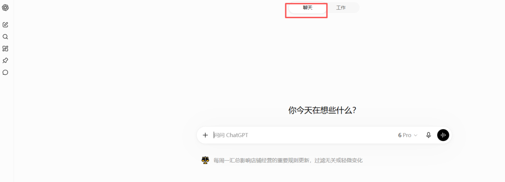

所以如果我们能把网页版的额度给Codex使用，网页版进行梳理和推理或者生图,规划好步骤之后执行交给Codex，岂不两全其美。那么怎么才能做到呢，

那就不得不提万能的GitHub仓库了，有人把这个事情做到并开源了，地址：  github.com/yyjeqhc/webcodex

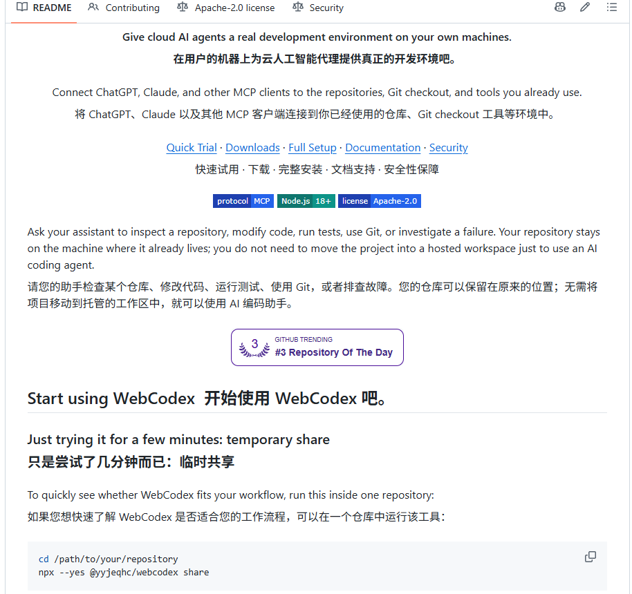

链接成功之后能干什么，有哪些优缺点？

怎么实现呢？下面开始！

01

首先安装  webcodex桌面客户端

  
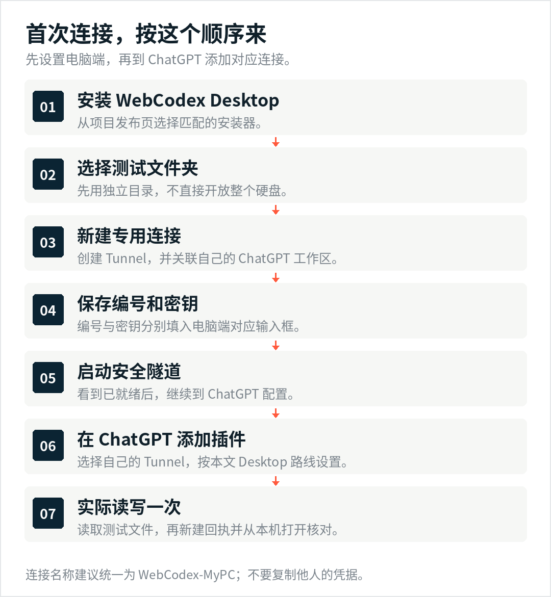

首先把仓库地址丢给codex或者WorkBuddy：

github.com/yyjeqhc/webcodex

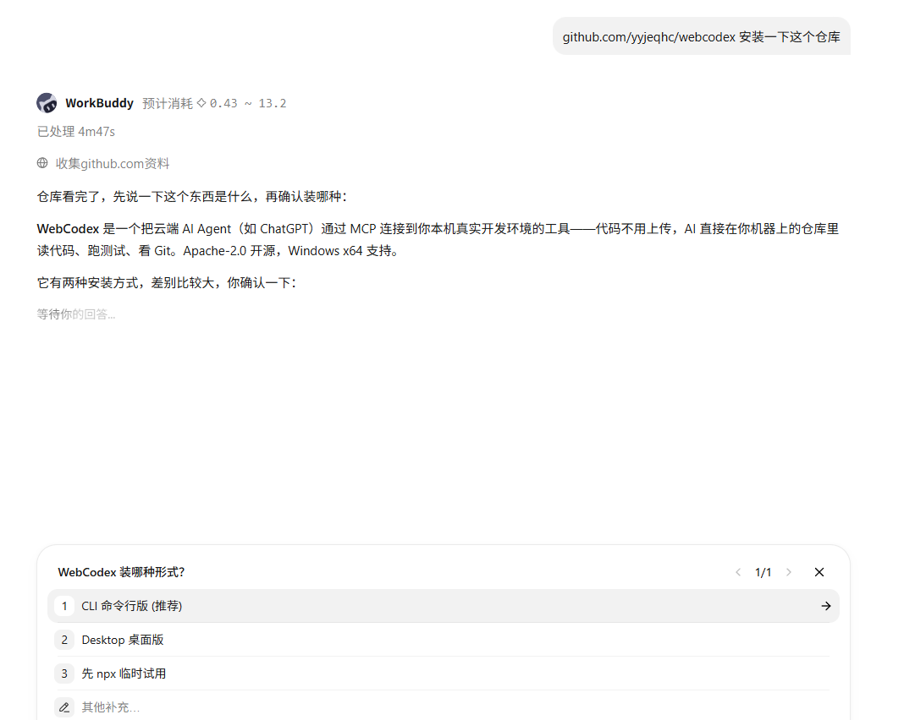

这里我们选择桌面版客户端，方便后续操作，整个过程差不多三五分钟，

或者自己去仓库页面找到Release,点击跳转之后按照版本下载就行

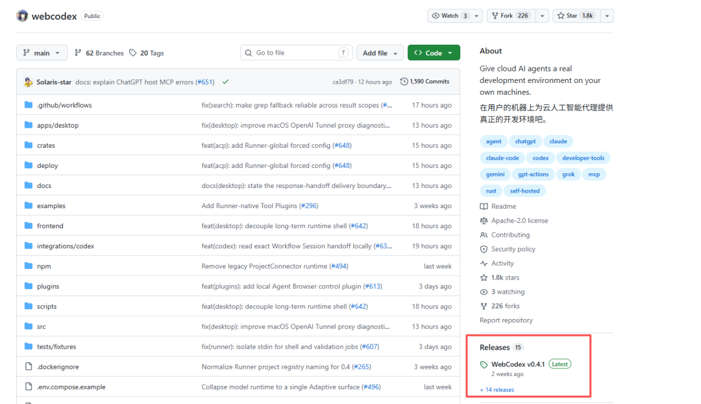

Windows

选 webcodex-desktop-v0.4.1-win32-x64-setup.exe（21.2 MB）

Mac（按芯片分两种）

M系列芯片（Apple Silicon）→ 选 webcodex-desktop-v0.4.1

老款 Intel 芯片 Mac → 选 webcodex-desktop-v0.4.1

不确定芯片的话：点左上角苹果菜单 →「关于本机」，看到「芯片」写着 Apple M 系列就用 arm64，写「处理器 Intel」就用 x64

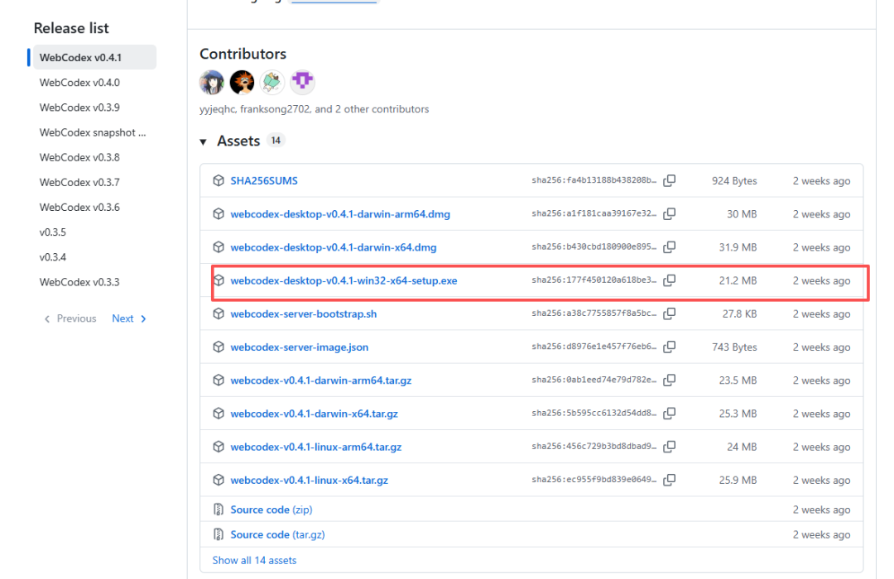

装好之后打开，页面长这样：

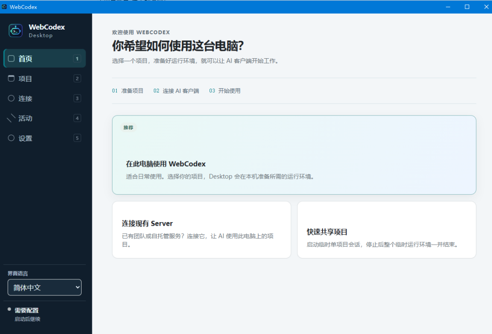

第二步：链接ChatGPT网页版

点击  在此电脑使用WebCodex

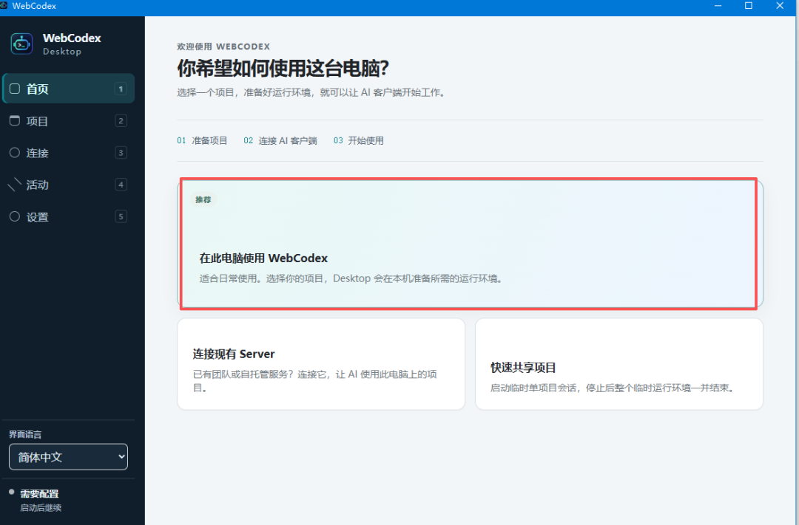

之后选择文件夹

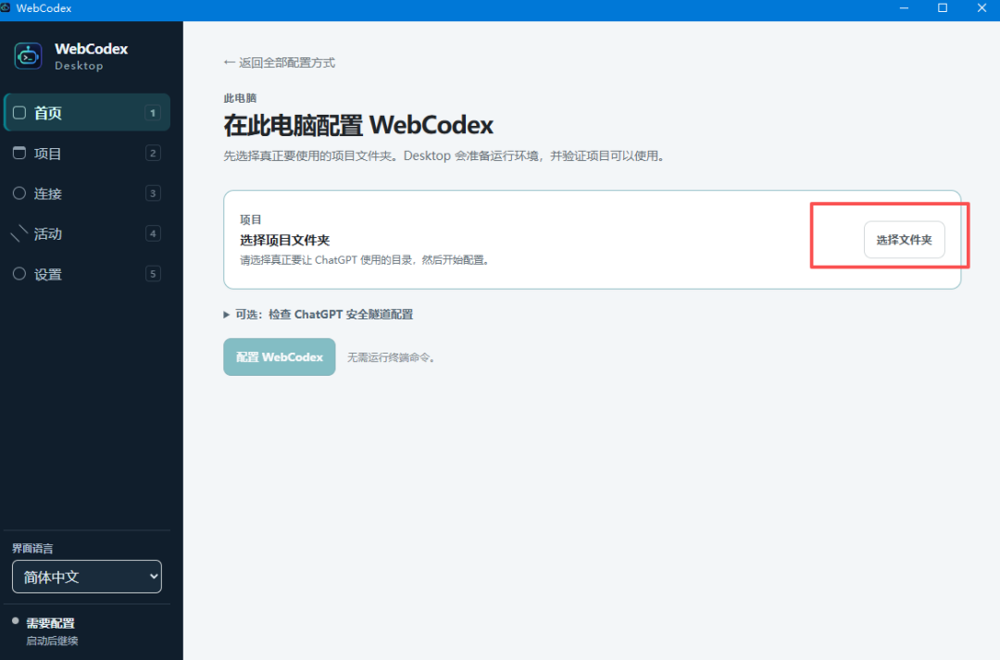

随便新建一个文件夹都行，比如

E:\网页版

先用测试目录，不要直接授权整个硬盘。建好之后选择文件夹路径即可

回首页展开「查看运行诊断」  ，确认  ` Service  ` 、  ` Runner  ` 、  ` Project  `
都准备好了，路径也正确。状态不对先处理这一步，不急着往后填连接。

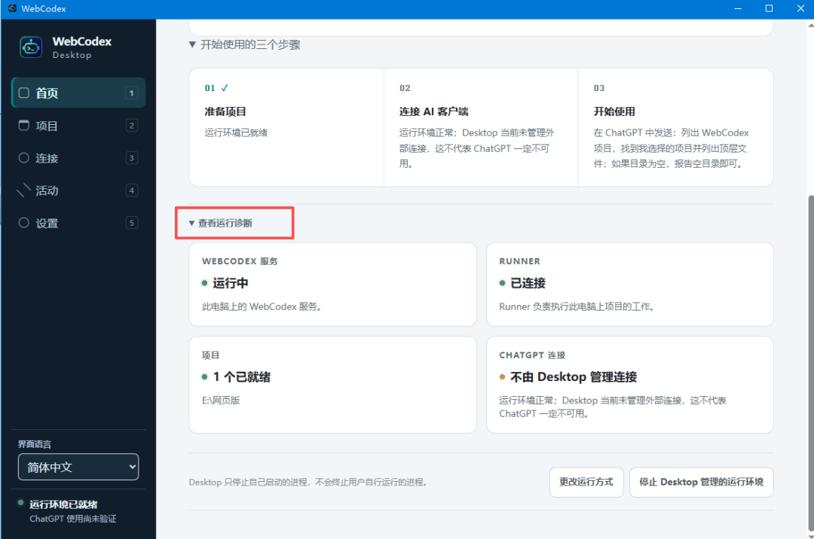

展开「查看运行诊断」，检查本机服务、Runner 与项目的状态。

第三步：给这台电脑建一条专用连接

浏览器打开：

https://platform.openai.com/settings/organization/tunnels

登录自己的账号，点击右上角  Create tunnel  。名称随便写：

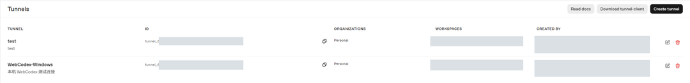

在平台的 Tunnels 页面，点击右上角「Create tunnel」。

WebCodex-MyPC

` Tunnel  ` 先理解成连接通道。下面两个字段分别设置：

Organizations：选这条连接所属的平台组织，个人账号选自己的个人组织。

ChatGPT workspaces：选准备使用它的 ChatGPT 工作区

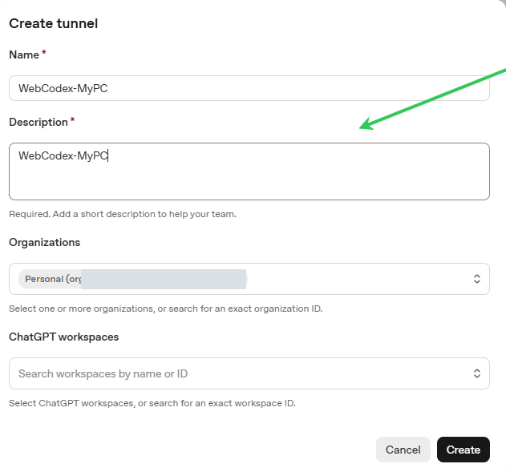

填写新连接名称。此图还没选 ChatGPT workspaces，接着看下一张。

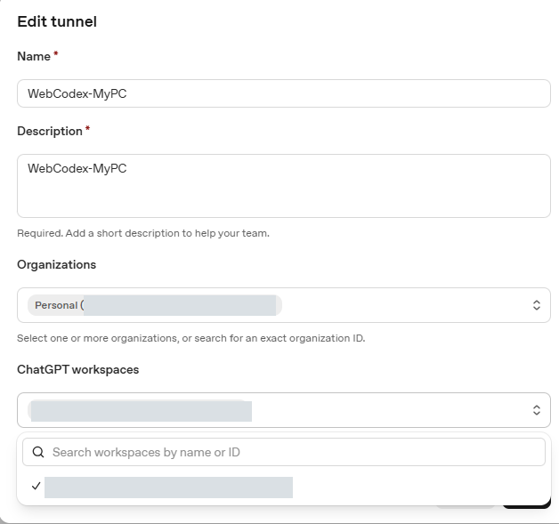

选中自己的 ChatGPT 工作区，确认出现勾选和标签后，再保存。

保存后，复制平台生成的、以  ` tunnel_  ` 开头的完整编号，后面填回电脑。

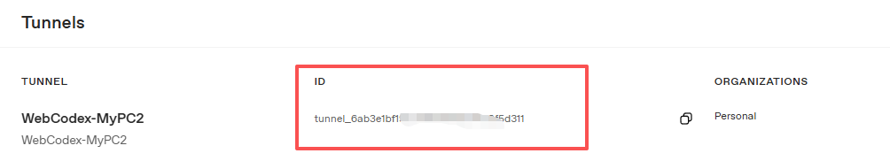

名称是给自己辨认的，编号才是后面连接时要用的。复制时认准新建的这一行，不把旧连接的编号和新名称混在一起。

第四步：准备连接用的 API key

编号与密钥是两样东西：  前者指定连接，后者用于验证使用权限。

首先打开：

https://platform.openai.com/settings/organization/api-keys

确认组织与刚才一致，点击  Create new secret key  ，名称随便写

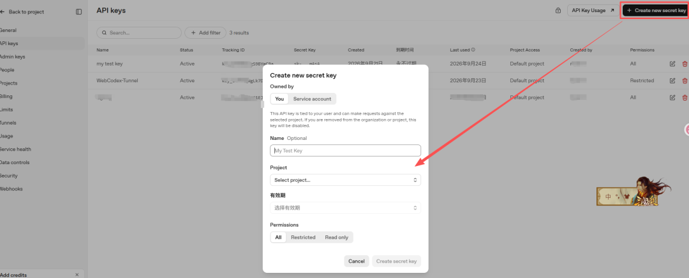

优先用  Restricted  ，按文档配置必要的  ` Tunnels: Read  ` 和  ` Tunnels: Use  ` 。  

创建后妥善保存，完整密钥通常只显示这一次。  只填进本机 WebCodex，不发聊天、不放进截图。也可以把  密钥复制保存下来，以防忘记了。  

API key 是连接凭据，  不等于把任务改成模型 API 计费  。  

第五步：填回 WebCodex，保存，再启动

回到电脑上的 WebCodex，进入「连接」→「检查 ChatGPT 安全隧道配置」或对应配置区域。

Tunnel ID 填连接编号，Tunnel API key 填密钥。

点击「保存配置」  ，再点  「启动安全隧道」。别误点旁边的清除配置。

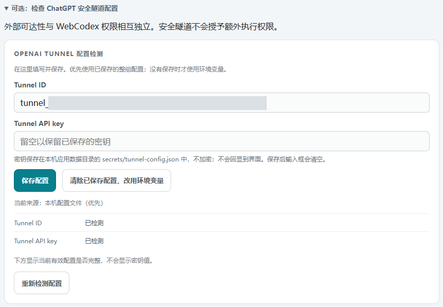

保存后密钥框清空，不一定是没保存；已保存时会提示「留空保留密钥」  

等它显示：

OpenAI Secure Tunnel 已就绪，等待 ChatGPT 连接

电脑这边准备好了。「等待 ChatGPT」不是让你重新创建连接，下一步去 ChatGPT 添加即可。

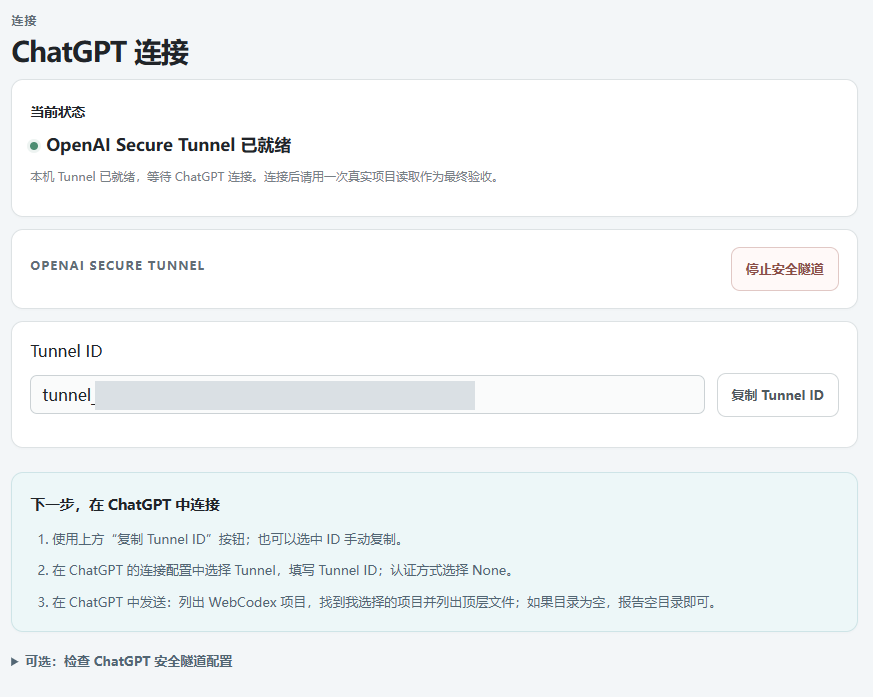

电脑端新连接已就绪。接下来到 ChatGPT 添加它，再做实际读写检查。

第六步：在 ChatGPT 添加对应插件

回到网页端左下角-设置，确认开发者模式已开启，开发者模式在插件里面

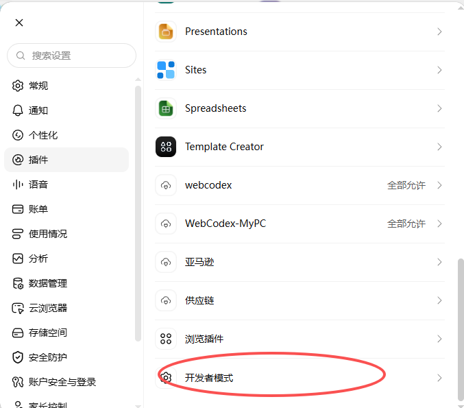
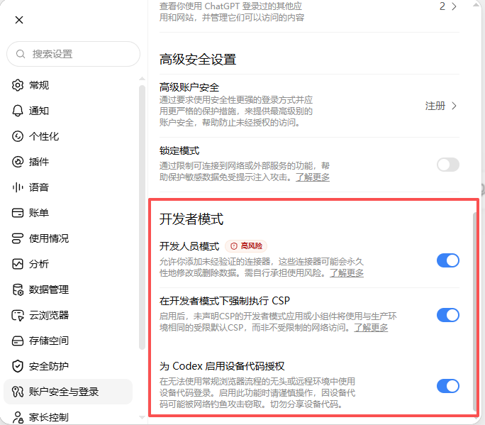

进入插件／应用管理页

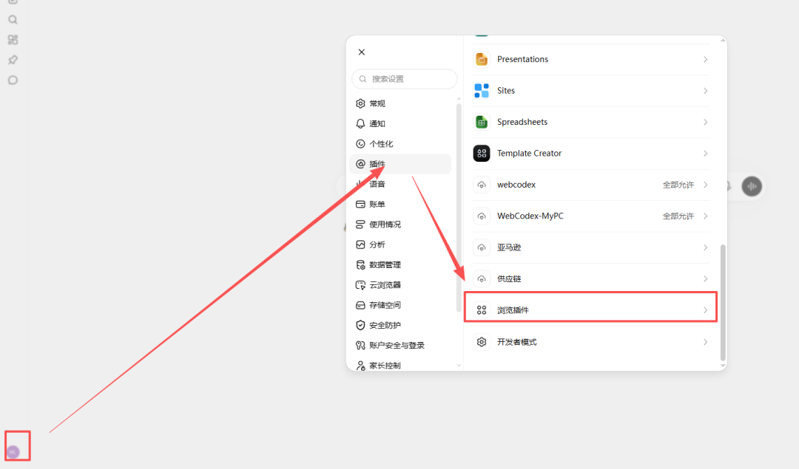
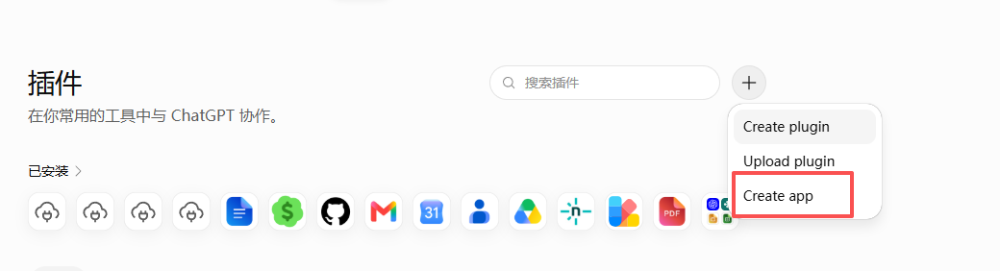
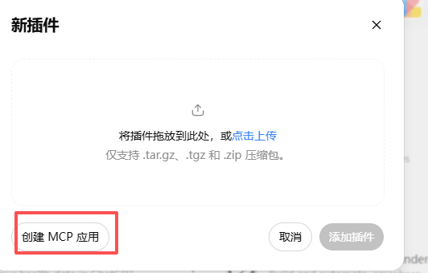
创建MCP应用后，按照下图方式来
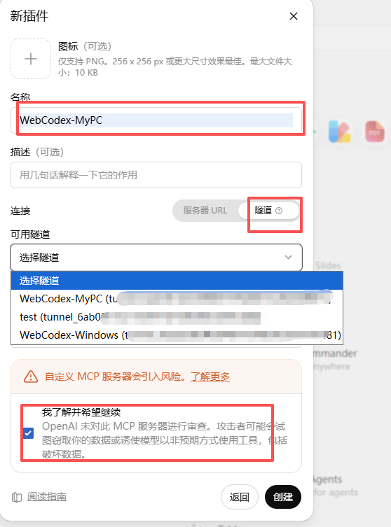
项目  |  填写内容  
---|---  
名称  |  ` WebCodex-MyPC  `  
连接方式  |  ` Tunnel / 隧道  `  
可用隧道  |  选择刚创建的那条，或填完整 Tunnel ID  
身份验证  |  ` None / No Auth / 无身份验证  `  
  
核对完整编号，不只看名字。列表没出现新连接，先检查前面的 ChatGPT 工作区是否关联，以及自己是否有使用权限。  

回到插件这里，看到之前创建的名称就代表成功了

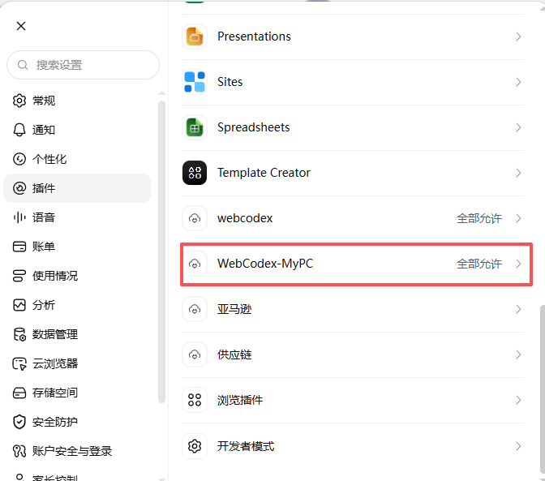

第七步：测试一下

AI 应用实战派 PRO

觉得本文还不错，赶紧点赞收藏吧。

---

本文最初发布于微信公众号「AI应用实战派PRO」。未经特别说明，正文与配图采用 [CC BY-NC-ND 4.0](https://creativecommons.org/licenses/by-nc-nd/4.0/deed.zh-hans) 许可。
