# 我们对GitHub的了解，可能还不及1%

> 作者：旺哥 · 公众号：AI应用实战派PRO  
> [查看微信公众号原文](https://mp.weixin.qq.com/s/wOIv0ZesuK17WKrcoc8a4Q)
> [下载 HTML 图文包（含图片）](https://github.com/wangge-dev/wangge-articles/releases/download/html-archive/202609271740.zip) · [HTML 文件](../../html/2026/202609271740/article.html)

前几天发现 WebCodex 的时候，我真没想到，GitHub 上连这样的仓库都有。

[ Codex额度不够用？简单几步教你把闲置的网页版额度当Codex使用（附完整教程）
](https://mp.weixin.qq.com/s?__biz=MzY4NDA4MDUwMA==&mid=2247485562&idx=1&sn=40b92eeba44492e040f2c523abd7ac05&scene=21#wechat_redirect)

还有一次，实战群群友问怎么做 handoff。和 AI 聊得太长，换个新对话，前面的工作怎么接上？一搜，GitHub 上也有专门的 handoff
Skill。

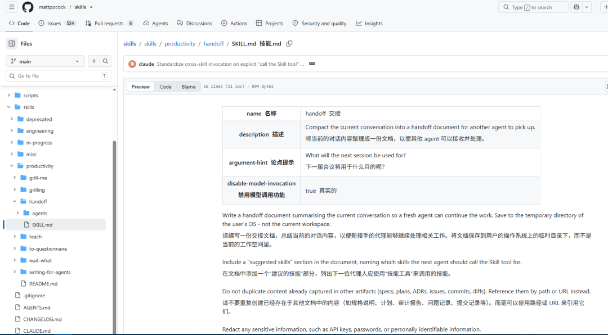

一个是把 AI 接到电脑，一个只是交接方法。两件事，都已经有人做出来了。

那还有多少我们正在琢磨的问题，别人已经解决，放在 GitHub 上了？

所以趁着假期没啥事，我去搜索整理了一些，万万没有想到，

发现范围比想象中大得多。AI 助手、电商主图、学习课程、博物馆数据，很多东西，根本没想过可以来这里找。

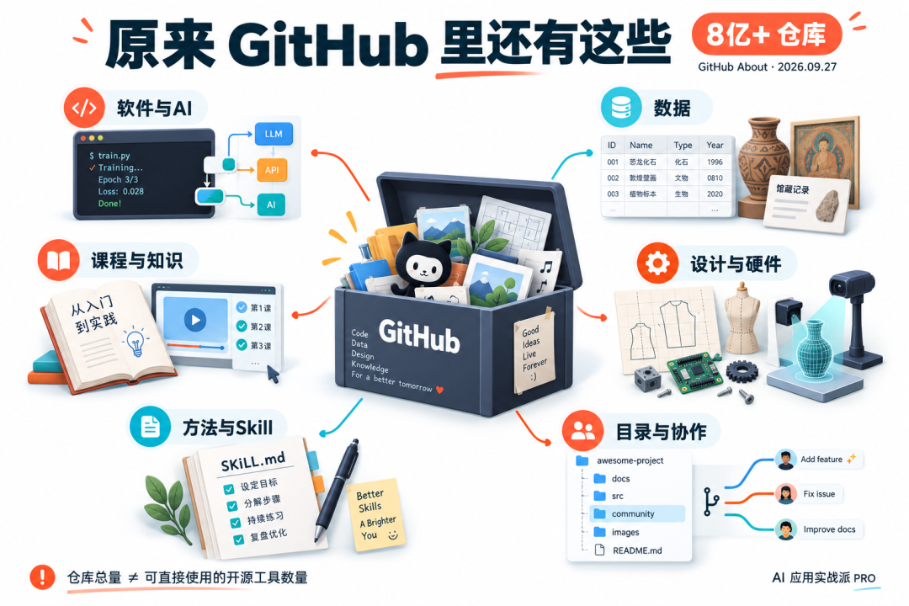

GitHub 上，到底有什么？

很多人对 GitHub 的印象，还停在“程序员放代码的地方”。事实远远不止

除了代码，还可以有  数据、文档、设计文件、课程和操作方法。

我之前也写过github相关的文章，从安装到发现仓库，到玩法都有：

[ 5000字教你入门github仓库，新手小白看这篇就行了（从看会到搭建仓库完整流程）
](https://mp.weixin.qq.com/s?__biz=MzY4NDA4MDUwMA==&mid=2247483857&idx=1&sn=0895c9cd3765f40ad11ce7fc2e642a0c&scene=21#wechat_redirect)

[ OpenHuman 刚冲上 GitHub 万星：看懂 5 个用法和 OpenClaw / Hermes 有啥不同
](https://mp.weixin.qq.com/s?__biz=MzY4NDA4MDUwMA==&mid=2247483925&idx=1&sn=75905fc261fb07bc7d97d3f032a31282&scene=21#wechat_redirect)

[ GitHub 系列：一个 Skills 帮你挖掘高潜力的Github仓库
](https://mp.weixin.qq.com/s?__biz=MzY4NDA4MDUwMA==&mid=2247484049&idx=1&sn=bfcdd7386b9b28d954f430f2da44359e&scene=21#wechat_redirect)

[ 这5个 AI+电商 Github仓库你值得拥有
](https://mp.weixin.qq.com/s?__biz=MzY4NDA4MDUwMA==&mid=2247484099&idx=1&sn=d0805c16ca0602c48b40ae2fe0fe102e&scene=21#wechat_redirect)

[ 这 6 个 GitHub 仓库，让你的 Codex 真正好用起来
](https://mp.weixin.qq.com/s?__biz=MzY4NDA4MDUwMA==&mid=2247484115&idx=1&sn=c71179355429ee837db2849a4adc4763&scene=21#wechat_redirect)

[ 我用Codex+4个 Github 仓库把微信文章做成了一套 AI 知识库SOP
](https://mp.weixin.qq.com/s?__biz=MzY4NDA4MDUwMA==&mid=2247484168&idx=1&sn=27e05bf33edc7973ee1f909d9d02ade9&scene=21#wechat_redirect)

[ AI电商实战教程: 我用Codex + 6 个 GitHub 仓库，跑通了一套电商作图 SOP
](https://mp.weixin.qq.com/s?__biz=MzY4NDA4MDUwMA==&mid=2247484134&idx=1&sn=45b425bac946350285021aec0d703fe7&scene=21#wechat_redirect)

目前展示的仓库总量超过 8 亿。当然，里面包含私有仓库、项目副本和练习，

不过，对我们来说，没必要搞清楚全部。先知道自己关心的那一块，已经有些什么。

今年年初火起来的 OpenClaw，就在 GitHub 上。我们平时用的 Codex，也有公开的 CLI 仓库。

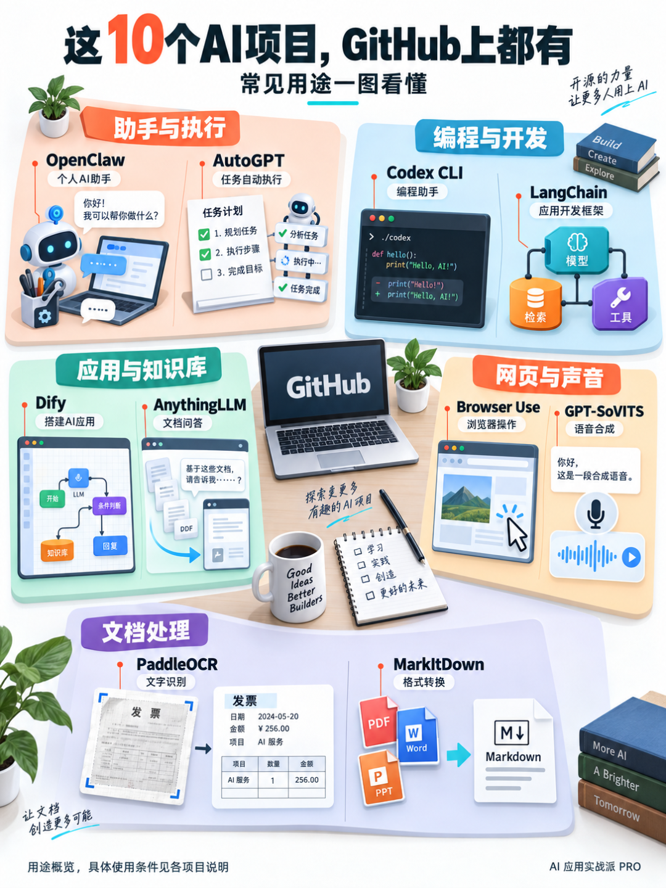

下面这十个项目，都是受到大量关注的 AI 相关项目，覆盖助手、编程、知识库、语音和文档处理。

1\. OpenClaw｜约 39.1 万 Star

年初大家讨论的“养龙虾” ：  https://github.com/openclaw/openclaw

2\. Codex CLI｜约 12.7 万 Star

OpenAI 的终端编程助手。

https://github.com/openai/codex

3\. Dify｜约 15.7 万 Star

用可视化流程组织模型、知识库和工具，搭建自己的 AI 应用。

https://github.com/langgenius/dify

4\. AutoGPT｜约 18.8 万 Star

较早受到广泛关注的 Agent 项目之一，提供构建和运行智能体工作流的平台。

https://github.com/Significant-Gravitas/AutoGPT

5\. Browser Use｜约 11.6 万 Star

让 AI 操作浏览器，读取页面、点击、填写和执行网页任务。

https://github.com/browser-use/browser-use

我也写过文章：

[ WorkBuddy 装上 BrowserSkill 之后真的能照着我的操作干活了！
](https://mp.weixin.qq.com/s?__biz=MzY4NDA4MDUwMA==&mid=2247484759&idx=1&sn=be2017e277e9e058560e6a2f5f1709af&scene=21#wechat_redirect)

6\. AnythingLLM｜约 6.7 万 Star

把自己的文档接入问答和 Agent 工作区，可选择本地或云端模型。适合了解个人、团队知识库是怎么搭起来的。

https://github.com/Mintplex-Labs/anything-llm

7\. GPT-SoVITS｜约 6.2 万 Star

用声音样本进行语音合成、少量数据微调和跨语言生成。做自己的配音或研究语音应用。  

https://github.com/RVC-Boss/GPT-SoVITS

8\. PaddleOCR｜约 9 万 Star

识别图片、扫描件中的文字，还能处理文档版面、表格等内容。

https://github.com/PaddlePaddle/PaddleOCR

9\. MarkItDown｜约 18.7 万 Star

微软做的文件转 Markdown 工具，支持 PDF、Word、PPT、Excel 等格式。

https://github.com/microsoft/markitdown

10\. LangChain｜约 14.7 万 Star

面向开发者的 AI 应用框架，把模型、检索和工具调用接起来。

https://github.com/langchain-ai/langchain

11\. n8n｜约 206 万 Star

最火的工作流自动化平台：  https://github.com/n8n-io/n8n

想做一个 AI 应用时，先找找已有项目，很可能会省掉大量重复工作。

做电商，主图和详情页也能来这里找

拿 Image2 做商品图，除了自己试提示词，也可以先看看别人整理了什么。

https://github.com/freestylefly/awesome-gpt-image-2

awesome-gpt-image-2 收集了提示词、案例和模板，包含产品与电商等方向。

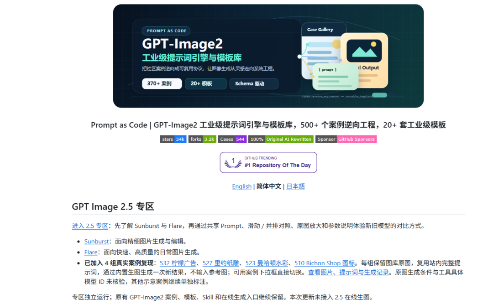

[ 分享一个 27.3K Star 开源 GPT-Image-2 提示词库 ：500+ 案例,20+ 模板以及 Skill（商品图/海报/动漫）
](https://mp.weixin.qq.com/s?__biz=MzY4NDA4MDUwMA==&mid=2247485021&idx=1&sn=9656268ab448e5a534c1311fe23cf6af&scene=21#wechat_redirect)

则把做图过程整理成了 Skill，覆盖主图、详情页图片、社媒素材等。

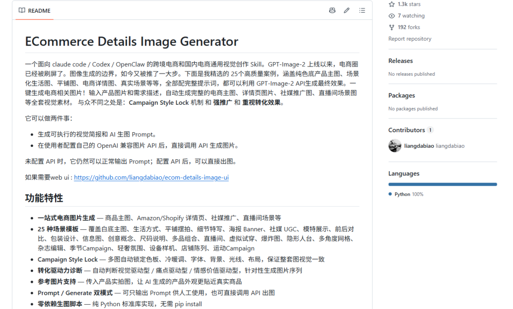

如果想要带界面的工具，EcomGen 提供了商品套图工作台，把素材、规划、生图、编辑和导出放到一起。

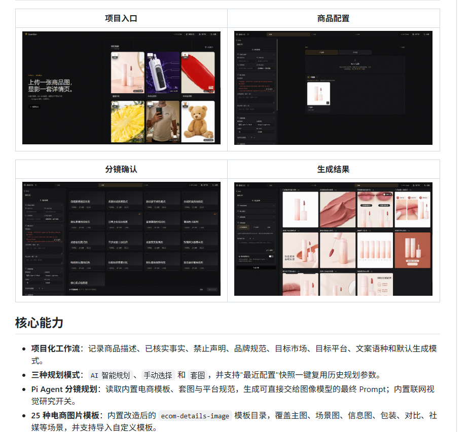

还有我自己做的GPT-image 2.5提示词库：

[ 分享一个最新开源GPT-image-2.5 提示词库 电商/海报/人物全都有（每日持续更新）
](https://mp.weixin.qq.com/s?__biz=MzY4NDA4MDUwMA==&mid=2247485294&idx=1&sn=8ce618f5a8421c87e14c8d4f90d02974&scene=21#wechat_redirect)

https://github.com/wangge-dev/wangge-gpt-image-2-5

那怎么找到自己需要的？

有具体需求，先搜事情，别急着搜产品名。

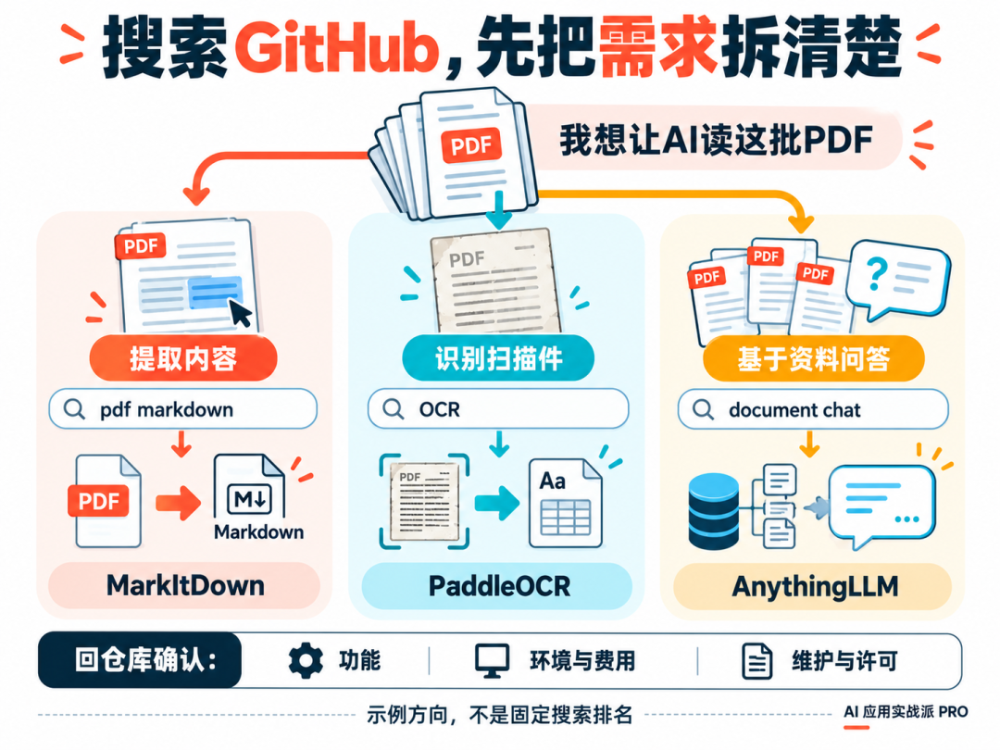

比如想把一堆 PDF 整理给 AI 看，在 GitHub 搜索框里，可以分别试  pdf markdown  、  OCR  、  document cha
。

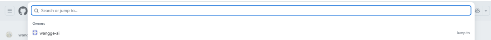

也可以在搜索引擎里搜  site:github.com PDF 转 Markdown  。中文没找到，再换英文。做电商也一样，搜  product
photography  、  ecommerce image  或  product detail page  ，通常比只搜“AI神器”更接近自己的需求。

没空天天找，可以先跟着会筛选的人看。

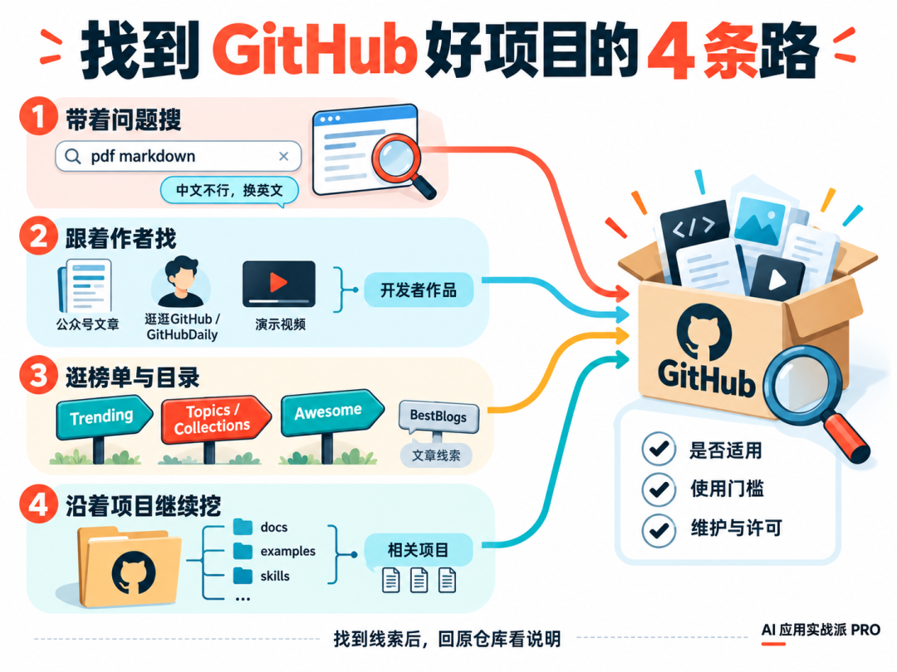

公众号里的逛逛GitHub、GitHubDaily，就是现成的中文入口。比如对 AI 学习和工作方法感兴趣，可以看看 Karpathy、Matt
Pocock 的其他仓库。

想自己逛，有榜单，也有整理好的目录。

• Trending：看近期哪些项目受到关注，适合发现新东西。

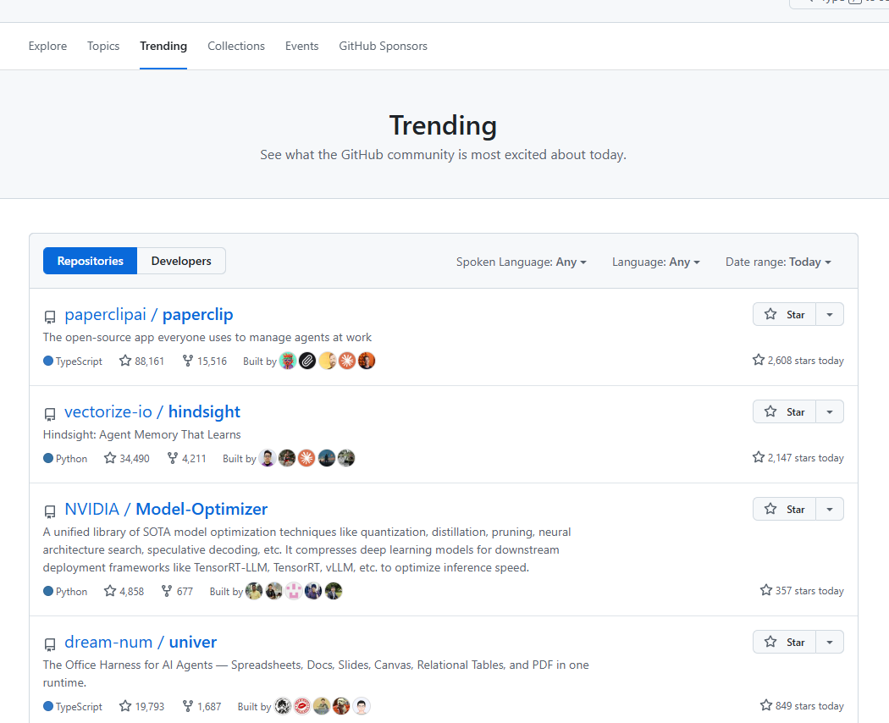

• Topics 和 Collections：按主题和专题找，适合了解某个领域还有什么。

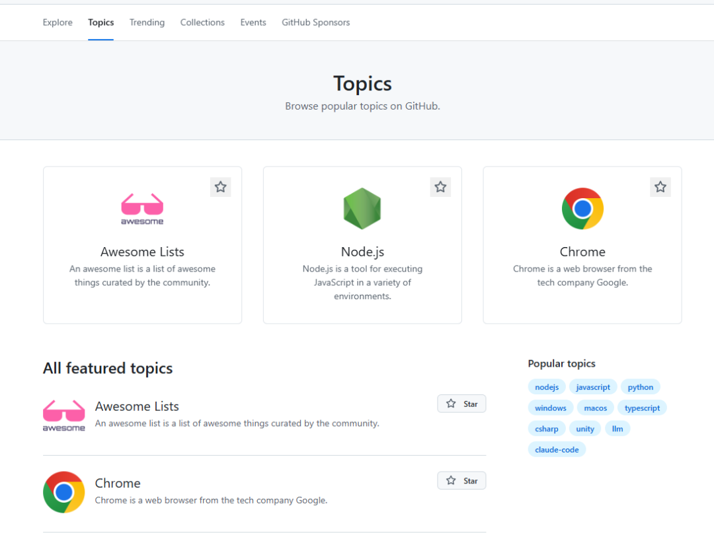

• Awesome：汇集不同主题的资源清单。也可以直接搜  awesome + 主题词  ，例如  awesome agents  ，再顺着目录找具体项目。

• BestBlogs：聚合技术文章等内容，适合从文章发现项目线索；它不是 GitHub 仓库搜索引擎，最后仍要回原仓库看。

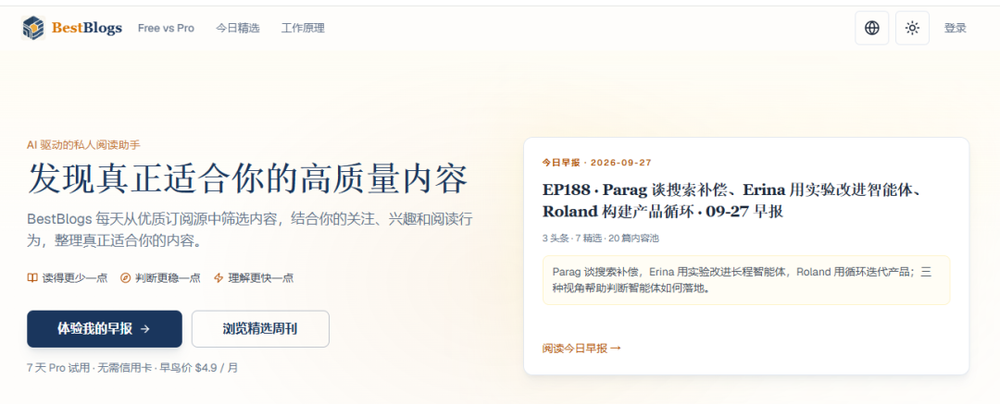

不会写代码，也可以先让 AI 帮你看

过去收藏一个仓库，常常卡在英文说明和安装命令上。现在可以把链接交给 AI。

我想解决的是【具体问题】。请阅读这个仓库的 README
和相关文件，告诉我它能不能解决、从哪里开始用，需要什么环境和费用。如果只需要其中某个文件，请直接指出来。同时检查维护情况、已知问题和许可证。结论附上依据，没查到的不要猜。

比如想做一个选品工作台、商品图工具、资料库，或者冒出其他想法，都可以先去 GitHub 搜一下。可能有完整项目，不一定要从零做。

不会搜，就直接把需求交给能联网的 AI。

我想做【具体工具或工作台】，主要给【谁】用，需要解决【哪几个问题】。请先搜索 GitHub，找已有项目、相关组件或可复用的
Skill。读取项目说明，比较它们能做什么、缺什么，需要哪些环境和费用，并附上原仓库链接。不要只列名字，也不要为了推荐而忽略维护状态和许可证。

先看看别人做到哪一步，再决定自己还要做哪一步。

咨询讨论请加：  HPwangtang

AI 应用实战派 PRO

觉得本文还不错，赶紧点赞收藏吧。

---

本文最初发布于微信公众号「AI应用实战派PRO」。未经特别说明，正文与配图采用 [CC BY-NC-ND 4.0](https://creativecommons.org/licenses/by-nc-nd/4.0/deed.zh-hans) 许可。
