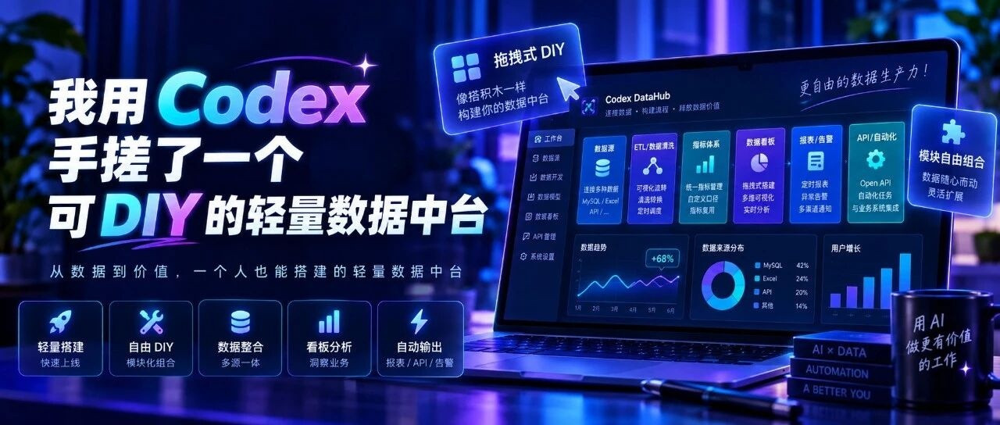

# 我用 Codex 手搓了一个可 DIY 的轻量数据中台

> 作者：旺哥 · 公众号：AI应用实战派PRO  
> [查看微信公众号原文](https://mp.weixin.qq.com/s/jH0W1dE2iySszq0vTKRswQ)

大家好呀，我是旺哥。今天给大家分享一个轻量数据中台制作的流程，

这个  轻量  数据中台是我用 Codex花了差不多两三个星期手搓的，只需要  Codex+Docker虚拟机  ，以及一些简单的vibe
coding技巧。

Codex大家都知道了，那Docker虚拟机是什么呢

当然看不懂也没有关系，我们开发的时候只需要把Docker开启，剩下的交给万能的 Codex 就行了，先看整体成果吧。

可以看到功能还是很多的哈，
考虑到大家的业务需求不一样，我设计这个数据中台的时候有些条件没有限制的那么死，目的就是让大家拿到开发说明可以根据自己业务的需求来对应的模块。

开发文档说明在留言区！

这套中台的特点，是把  电商预置模块、规则复用、DIY、AI 辅助和私有部署  放在一起。由于东西很多，下面就给大家简单介绍一下都有哪些功能。

##  01｜开始

内置了很多电商相关的模块：前台利润，多平台销售订单，广告花费，商品成本等等，如果有大家需要的，那直接拿来用就行了。没有的让codex加上就好了。

##  02｜电商  经营驾驶舱

我把原来的真实数据脱敏成模拟数据，做了电商经营驾驶舱，可以根据自己的业务来选择驾驶舱的展示形式。

店铺经营

淘系

如果嫌图表类型不够丰富，可以自己让AI来，我这里用的DS V4

##  03｜分析中心

分析中心适合先看有哪些事情需要关注。概览、未处理预警、AI 分析和时间对比入口集中在一页，具体数字再回对应模块确认口径。

功能很多，由于篇幅有限，大家拿到可以自己去研究研究

##  04｜电商前台利润

每个电商公司的前台利润逻辑不完全一样，但是大体思路是相同的。

前台利润的来源、试算、对账与发布

##  05｜可DIY智能体

有数据分析、客服话术、详情页文案和竞品分析四个入口。选定数据或填写资料，配置模型后就能发起任务。

四类业务智能体

##  06｜内置数据库入口 / 云服务配置工具

已经有业务数据库，可以配置 PostgreSQL 或 MySQL 连接，用只读查询查数和核对。管理员负责连接权限；自动同步的话需要另外接入采集任务。

外部数据库连接

云服务配置工具

云服务配置工具也预置好了  ，包括安装与实例初始化、HTTPS、定时备份、异地备份配置和健康检查。

•  本机安装  ：当前以 Windows x64 为主，需要 Docker Desktop、WSL 2 和硬件虚拟化。Docker 官方要求至少 8GB
内存，大表还要预留更多内存和磁盘空间。

•  团队服务器  ：准备包面向 Ubuntu 24.04 x86_64，项目建议从 4 核 8GB、约 180GB SSD 起步，容量按数据量调整。

•  日常使用  ：浏览器访问即可，不必每台电脑安装 Docker。AI 需要联网和模型 API，按模型服务计费。

##  07｜导入数据也很简单

根据不同的数据类型设置了不同的导入方式，

也支持文件夹导入，比如你有很多平台的数据想要统一格式，前期只需要把字段的对应关系捋好就行，捋好之后，统一放到一个文件夹里面，

导入数据

上传的时候，做好维护表，所有数据统一放到一个文件夹上传就行

##  08｜我是怎么让 Codex 搭起来的

我的思路是：先把每天重复整理报表的工作讲清楚，再把它做成能反复使用的模块。界面可以让 Codex 写，业务怎么算，得由自己定。

拿「各店铺推广花费」举例，可以这样拆：

先说想看什么。  我要按店铺、按日期看花费和变化，发现异常后能回到原始记录。先解决这一个问题，不急着把所有功能堆上去。

再把表和规则给清楚。  提供脱敏样表，告诉 Codex 哪列是店铺、哪列是日期、金额用哪一列；重复上传怎么算，哪些记录不计入。

让 Codex 把这套规则做进模块。  文件上传后怎么识别、字段怎么对应、结果怎么看、异常怎么提示，一起做成可用的流程。

最后再扩展业务。  推广模块理顺后，再接成本和利润。遇到直播日报这类新表，优先用页面里的 DIY 配置；需要跨表关联、接新接口或增加特殊页面，再让
Codex 开发，并检查有没有影响原有模块。

1\. 明确业务问题

↓

2\. 提供样表与口径

↓

3\. Codex 做成模块

↓

4\. 人工核对、换表检查

↓

5\. 复用规则、按需扩展

这里的分工很清楚：  人负责业务需求和验收，Codex 负责开发修改；平台内的业务 AI，则在使用时辅助分析。

完整开发者文档我放在了评论区，喜欢DIY可以把这些资料丢给Codex就行：

如果想现在就体验这个轻量数据中台可以加入我们的社群，下面是介绍：

[ 正式介绍一下我们的AI+ 电商VIP实战交流群
](https://mp.weixin.qq.com/s?__biz=MzY4NDA4MDUwMA==&mid=2247485411&idx=1&sn=9d5c90d6870983abb587e8c095f8d61d&scene=21#wechat_redirect)

咨询讨论请加：  HPwangtang

AI 应用实战派 PRO

觉得本文还不错，赶紧点赞收藏吧。关注我，还有更多精彩文章和教程。

---

本文最初发布于微信公众号「AI应用实战派PRO」。未经特别说明，正文与配图采用 [CC BY-NC-ND 4.0](https://creativecommons.org/licenses/by-nc-nd/4.0/deed.zh-hans) 许可。
