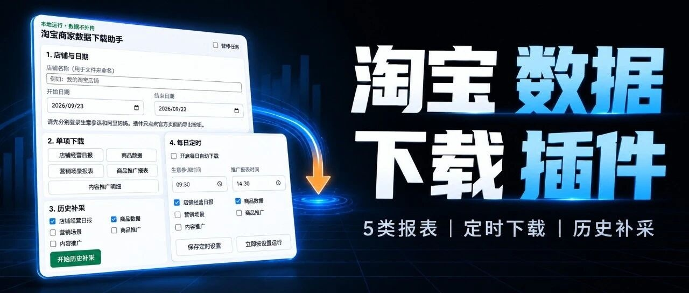

# 别再手动导出了：我把淘宝店铺数据下载做成了插件

> 作者：旺哥 · 公众号：AI应用实战派PRO  
> [查看微信公众号原文](https://mp.weixin.qq.com/s/8C-mlfujWxzICktkMXXLGw)

做电商运营，有一类工作很容易被低估。

它没什么技术含量，但每天都要重复：

打开生意参谋，选日期，导出店铺数据；再打开商品页面，导出商品数据；接着进入阿里妈妈，把营销场景、商品推广和内容推广报表分别下载下来。

偶尔做一次不麻烦。

但如果想连续观察一家店7天、30天甚至更长时间，真正难的不是分析，而是先把每天的数据稳定地拿到手。

只要中间漏了几天，后面的趋势、对比和诊断就容易断掉。

前段时间，VIP群里一位群友分享了一个淘宝店铺数据采集插件。我在这个基础上做了一些调整，并实际安装测试了一遍。

它解决的问题很直接：

** 把原来需要在多个后台里手动导出的报表，按日期自动下载到本地。  **

[

##  01  目前可以下载哪些数据

]

现在这个版本主要处理两部分数据。

第一部分是生意参谋：

  * 店铺经营核心日报； 
  * 商品数据。 

第二部分是阿里妈妈：

  * 营销场景报表； 
  * 商品推广报表； 
  * 内容推广明细。 

也就是店铺、商品和推广三条最常用的数据线。

使用时，先登录生意参谋和阿里妈妈，再填写一个店铺名称，选择日期，点击对应的报表即可。

插件做的不是调用什么神秘接口，而是在已经登录的官方页面里，按照设定的日期执行页面本身提供的导出操作。

下载下来的仍然是官方报表。

[

##  02  不想每天点，还可以设置定时下载

]

除了手动选择报表，插件还可以设置每日定时任务。

生意参谋和推广报表可以分别设置时间。例如上午下载店铺和商品数据，下午再下载推广数据。

电脑和浏览器保持运行、相关账号保持登录，插件就会按照设置执行。

如果临时不想运行，也可以直接暂停，之后再恢复。

定时下载不是云端任务。电脑关机、浏览器退出、登录失效，任务都不会凭空继续运行。

淘宝或阿里妈妈页面改版以后，原来的点击位置也可能发生变化，需要重新适配。

所以它不是装完以后永远不用管，而是把大量重复点击先自动化。

[

##  03  漏了几天，也可以按日期重新补采

]

插件还保留了历史补采功能。

选择一个日期范围，再勾选需要的报表，它会按天重新执行下载。当前单次最多选择31天，避免一次任务过长，也减少连续操作带来的风险。

需要注意的是，这个独立版本没有连接外部数据库。

因此它不会判断你的电脑里到底缺了哪一天，而是按照你选定的日期重新导出。

这一点看起来没有那么“智能”，但对普通商家更容易理解：数据保存在自己的电脑里，也不需要额外部署服务。

[

##  04  我觉得更重要的，是它可以继续让AI改

]

如果只是把报表自动下载下来，这个插件已经能节省一部分重复操作。

但我觉得它更有意思的地方，是提供了一个能够正常运行的基础版本。

以前拿到一个浏览器插件，想增加功能，第一反应往往是：我又不会写代码，怎么改？

现在可以换一种方式。

把插件文件夹交给自己的AI Agent，例如Codex或者Claude Code，再用自然语言告诉它你想改什么。

比如：

> 帮我增加一种新的报表类型。

> 每天晚上8点自动运行，只下载商品和推广数据。

> 下载后按照店铺、日期和报表类型重新命名。

> 删除我用不到的模块，让界面再简单一点。

> 下载完成后读取Excel，生成一份经营日报。

AI Agent可以检查插件代码、修改页面和任务逻辑，再运行测试。

这并不代表一句话就一定能改成功。平台页面、账号权限和浏览器环境都可能带来差异，修改以后仍然要用自己的账号逐项测试。

但门槛确实变了。

过去是“先学会开发，才能改工具”。

现在更接近“先找到一个可以运行的基础版本，再让AI围绕自己的业务需求继续改”。

[

##  05  数据自动下载以后，还能继续做什么

]

插件解决的只是第一步：把数据稳定地拿下来。

真正有价值的部分，是下载之后。

例如每天的店铺和商品报表齐了，可以继续让AI生成一份经营简报：

  * 访客、支付金额和转化率相比昨天有什么变化； 
  * 哪些商品访客上涨，但没有形成成交； 
  * 哪些商品加购较高，支付却明显偏低； 
  * 哪些商品连续多天流量或成交下滑； 
  * 推广花费下降后，成交为什么降得更快； 
  * 哪些商品的推广ROI持续偏低； 
  * 今天最需要处理的3件事是什么。 

再往前一步，还可以把每天的文件放进固定文件夹，自动合并成周报或月报。

整条链路可以变成：

** 淘宝后台 → 插件自动下载 → 本地Excel/CSV → AI读取分析 → 经营日报和行动清单。  **

这里也要区分两件事。上图是我做的一个生意参谋的工作台，抽空还在持续优化中。

另外自动下载是当前插件已经具备的能力。

自动分析、日报、异常提醒和行动清单，是有了这些本地文件以后，可以继续搭建的下一层工作流。

我不想把一个下载插件写成“全自动运营神器”。

它真正解决的是一个很基础、但很关键的问题：让数据持续、稳定地落到自己手里。

[

##  06  第一次使用，建议只测试一天

]

安装方式和普通的Chrome、Edge浏览器插件一样：打开扩展管理页，开启开发者模式，再加载解压后的插件文件夹。

第一次不要直接补30天。

建议先选择昨天，逐项测试：

  1. 商品数据； 
  2. 店铺经营日报； 
  3. 营销场景报表； 
  4. 商品推广报表； 
  5. 内容推广明细。 

[

##  07  最后

]

这个插件非常感谢VIP群里：【路明非】 他提供的原始版本， 我在基础上优化并升级成所有商家都可以使用的版本，另外我想说的是它不只是一个淘宝数据下载插件。

更重要的是一种做工具的思路：

** 先把最重复、最稳定的一段工作自动化，再让自己的AI Agent围绕业务继续修改。  **

当每天的数据能够稳定落到电脑里，后面的日报、诊断、提醒和复盘，才真正有了自动化的基础。

至于每家店最后要看哪些指标、生成什么报告、提醒什么异常，本来就不应该只有一个固定答案。

工具先把数据拿回来。

剩下的，再交给你的AI和你的经营问题。

【领取方式我放到评论区了， 有需要的大家自己下载~】

* * *

我是电商腿毛哥，既然看到这里了， 如果觉得有用，顺手点个赞吧~

沟通交流+：dstuimaoge

---

本文最初发布于微信公众号「AI应用实战派PRO」。未经特别说明，正文与配图采用 [CC BY-NC-ND 4.0](https://creativecommons.org/licenses/by-nc-nd/4.0/deed.zh-hans) 许可。
