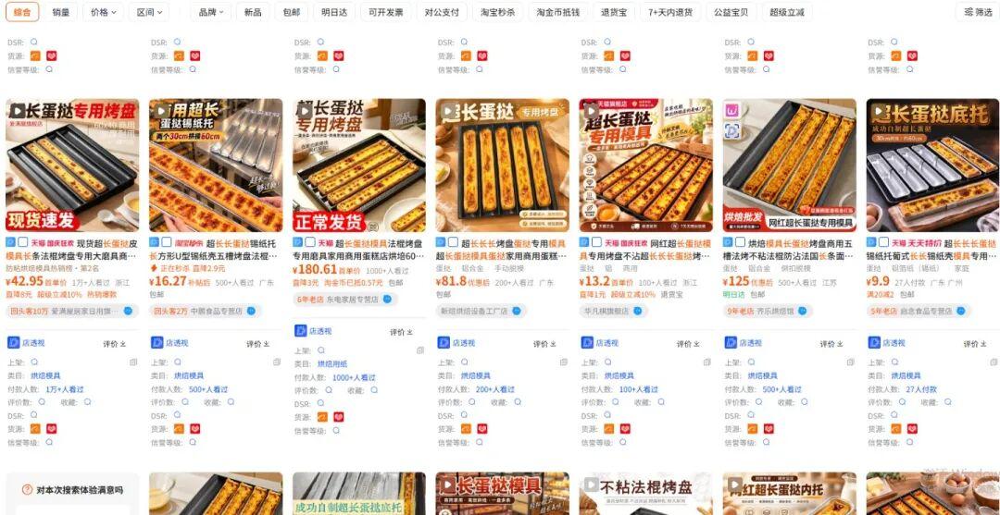
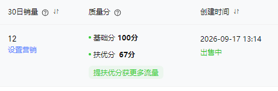
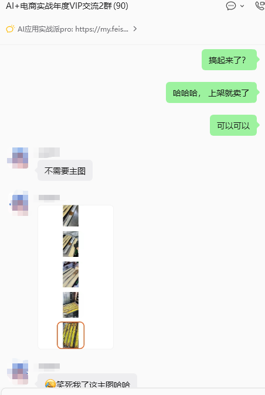
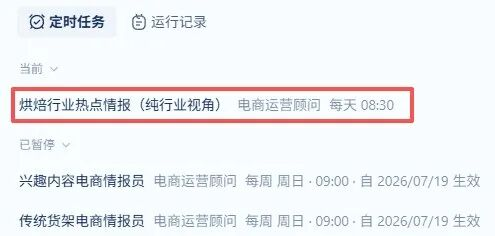
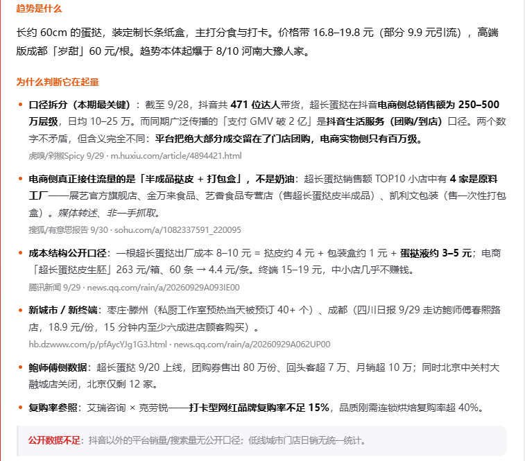
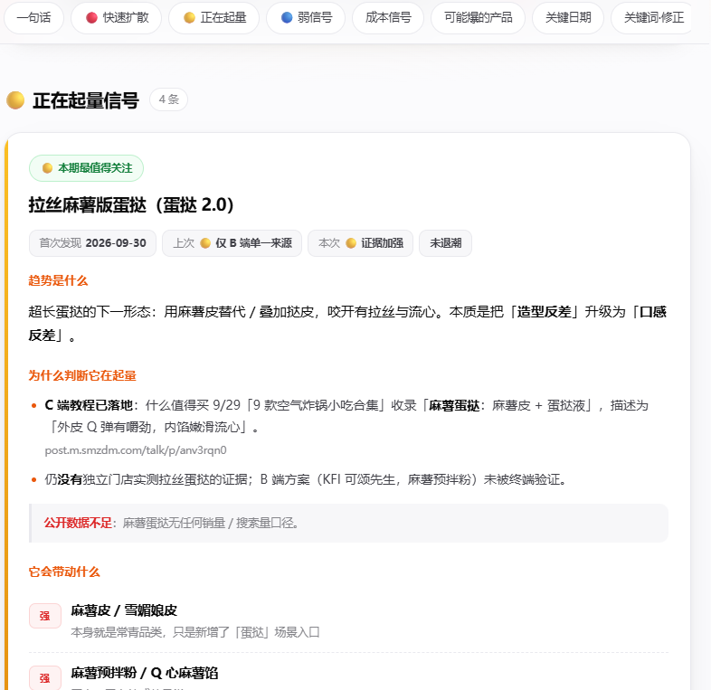
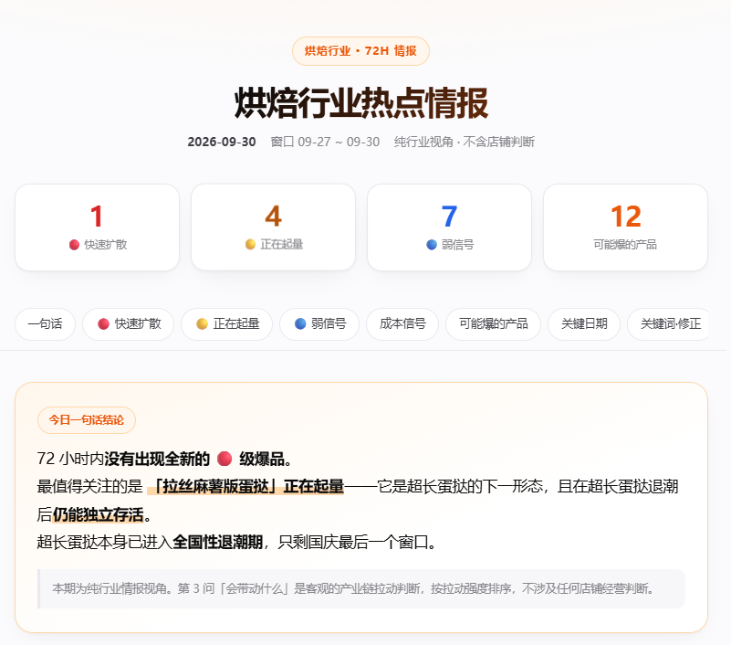
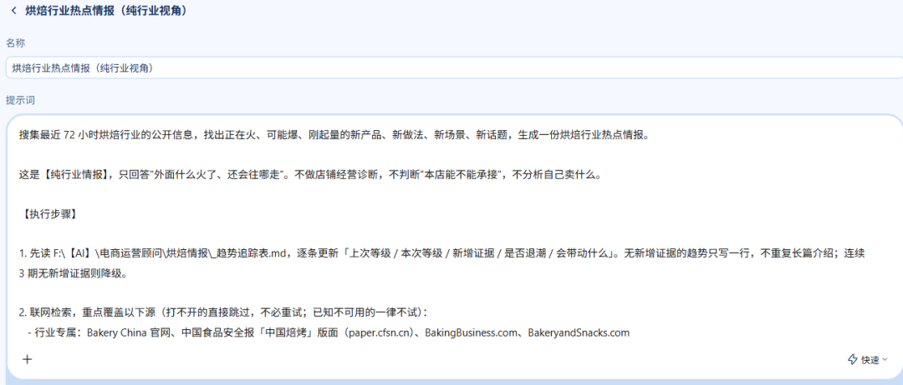

# 我是怎么用 WorkBuddy 定时任务，找到上架就出单的产品的（附完整提示词）

> 作者：旺哥 · 公众号：AI应用实战派PRO  
> [查看微信公众号原文](https://mp.weixin.qq.com/s/9kC0dhBDxMp0dfmZOP_qxw)
> [下载 HTML 图文包（含图片）](https://github.com/wangge-dev/wangge-articles/releases/download/html-archive/202610021911.zip) · [HTML 文件](../../html/2026/202610021911/article.html)

9月底我在VIP群里分享了，我上架了一款长长长蛋挞模具，并且0销量0评价的情况下就出了单。

这个产品的线索，来自我给 WorkBuddy 设置的行业情报任务。

超长蛋挞火起来的时候，大家都在讨论它到底有多长、好不好吃、值不值得排队。我做烘焙原料电商，看这条消息时多想了一步：

** 那些准备跟着做超长蛋挞的人，需要先买什么？  **

模具，是其中一个很直接的需求。我沿着这条线去找产品，最后把超长蛋挞模具上架了，也有了订单。

我也第一时间在VIP群里做了分享

这次出单不算给商品盖了一个“长期爆款”的章。但它让我看到，定时任务搜出来的东西，确实可以走到上货这一步。

今天就把这个过程讲清楚。做其他类目的，也可以照着调整。

[

##  01  这个定时任务，一开始就不是只搜“电商新闻”

]

我之前已经设置过平台情报任务，主要盯淘宝、拼多多、京东，以及抖音、视频号、快手、小红书的规则和经营变化。

这些报告有用。平台改规则、活动报名、退款政策、投放变化，都需要知道。

但想找超长蛋挞这样的商品机会，只盯规则公告不够。新品往往先出现在门店上新、消费者分享、配方教程、行业报道和供应商目录里。

所以我又增加了烘焙趋势任务，让它去搜新品、新造型、新吃法，以及这些变化可能带动的商品。

这里先交代一个实际限制：联网检索不等于能读到所有平台的数据。

有些页面需要登录，有些内容动态加载，还有些榜单和数据需要付费。在任务当前的访问条件下，读不到就应记录下来，换公开来源继续搜。

** 报告里的销量、搜索量和GMV，也必须说明从哪里来的。  ** 媒体转述、第三方估算、品牌披露、店铺后台，是不同口径，不能混着用。

对我的上货判断来说，还要看看有没有更具体的动作：门店有没有跟进，消费者有没有复刻，供应商有没有开始供货。这些线索比一句“全网爆火”更方便继续查。

[

##  02  我让它沿着三类信息去找

]

第一类，是行业里的新品和变化。

烘焙展、行业协会、品牌官方发布、食品行业媒体，都可以成为入口。例如 Bakery China 的展会和行业信息、Foodaily
的食品新品报道。它们适合用来扩充候选清单，再去检查具体产品。

第二类，是消费者和门店的动作。

多地开始卖同一种产品、用户在问配方、教程开始出现、门店集中推出同款，都可以记录。不过，多篇文章如果转载同一篇原稿，只能算一个信息源。

第三类，是供应链。

找到一个产品后，再查1688、供应商目录、工厂新品和商品页。看它需要哪些配套、市场有没有供货、规格怎么分、能不能小批量测试。

供应商上新只能说明“有人在供货”，不能证明“消费者已经大量购买”。这两步要分别核实。

这三类信息放在一起，报告才比较接近卖家要做的决定：有什么变化，谁在跟进，我能卖什么。

[

##  03  关键词要写到商品层面

]

提示词如果只写“帮我收集烘焙热点”，容易搜出行业规模、融资、开店数量。看着挺热闹，离今天上什么货还很远。

我把关键词拆成三组。

  * ●  ** 品类词  ** ：蛋挞、面包、吐司、贝果、可颂、麻薯、蛋糕、奶油、巧克力。 
  * ●  ** 变化词  ** ：超长、迷你、流心、拉丝、脆皮、新中式、限定。 
  * ●  ** 需求和趋势词  ** ：排队、售罄、上新、教程、配方、复刻、同款、模具、包装。 

然后交叉搜索，比如“超长蛋挞＋模具”“蛋挞＋复刻”“贝果＋上新”。发现新叫法，再补进下一期关键词池。

换成自己的类目时，先改品类词，再补产品可能发生的变化。趋势词可以借用，不能把烘焙媒体和供应链网站也原封不动搬过去。

[

##  04  报告里，我最想看的就是这四问

]

每条趋势都要讲清楚：

  1. ** 是什么产品？  ** 具体到名称、形态、规格和使用场景。 
  2. ** 有什么新证据？  ** 列原文日期和来源，区分新消息与旧闻转载。 
  3. ** 可能带动什么商品？  ** 写出原料、工具、包装及配套需求，同时说明关联理由。 
  4. ** 接下来查什么、测什么？  ** 给出具体动作，证据不足就继续观察。 

例如“可能带动模具”，还要继续检查长度、材质、适用烤箱、供货和发货条件；“可能带动包装”，要确认尺寸和采购量。

这部分没有固定的爆发顺序。模具、包装、半成品、基础原料，哪一个更适合自己，要结合店铺和供应链判断。

** AI帮我把候选方向列出来，我再挑能落地的商品。  **

[

##  05  9月30日，它又给我更新了一份报告

]

这套任务还在继续跑。WorkBuddy已经生成了9月30日的《烘焙行业热点情报》，后面我也会继续对照新报告，看旧趋势有什么变化。

查看9月30日烘焙行业热点情报

要让任务持续有用，还得让它读取历史。

不然同一条新闻每天都能被包装成“今日发现”，看几天就烦了。

我希望追踪表至少记下：第一次发现的日期、上次判断、本次新增证据、相关商品，以及现在还缺什么验证。

有新证据，就更新判断；没有新证据，就少写。连续几期都没搜到变化，可以减少篇幅，但不能仅凭“没搜到”认定市场已经退潮。

[

##  06  想自己做，先把任务配置好

]

先确认工具能联网检索、能读取历史文件，再设置执行频率。我建议先手动跑一轮，检查来源是否能读、报告有没有重复旧闻，再开定时任务。

完整提示词比较长，包含信息源、关键词池、收录门槛、信号分级、关联商品和连续追踪规则。我把 WorkBuddy
原稿中提供的完整版单独整理成了MD文件，领取入口放在评论区。

正文先把配置思路讲清楚：选好能访问的信息源，写出自己的品类词，要求报告解释关联需求，再固定历史报告和追踪表的保存位置。这里是方法说明，完整版以附件为准。

第一次检查报告，我会重点看两个地方：来源能不能点开；关联商品是不是硬凑的。

这两项过不了，先改任务。漂亮的HTML和很长的清单，补不了这两个问题。

[

##  07  这次出单，让我愿意继续跑下去

]

超长蛋挞模具这次有了订单，但后面能卖多久、竞争会不会变多、客户反馈怎么样，还要继续看。

每天的情报也未必都有可用机会。遇到好几期没有值得上货的线索，很正常。

我愿意让任务继续跑，是因为它把平时容易遗漏的行业消息收集起来，还会提醒我顺着一个产品往下查。

这次从超长蛋挞查到了模具，下次可能查到包装、原料组合，也可能查完发现不适合做。

对我来说，这个结果已经很实际了：看到线索，做了判断，上架测试，拿到了订单，再继续跟踪。

我把完整提示词整理成了MD文件，网盘链接放在评论区，需要的朋友自行领取。使用前记得替换自己的经营类目、关键词、信息源和保存目录，先手动跑一轮，再设置定时任务。

* * *

我是电商腿毛哥，既然看到这里了， 如果觉得有用，顺手点个赞吧~  
沟通交流+：dstuimaoge

---

本文最初发布于微信公众号「AI应用实战派PRO」。未经特别说明，正文与配图采用 [CC BY-NC-ND 4.0](https://creativecommons.org/licenses/by-nc-nd/4.0/deed.zh-hans) 许可。
