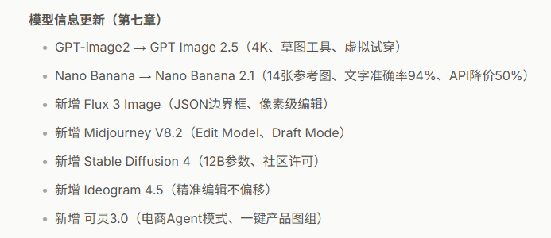
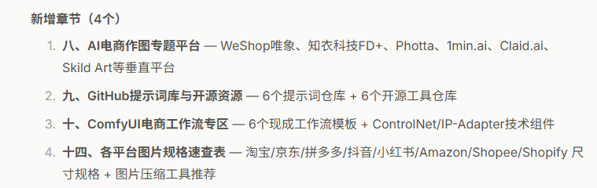
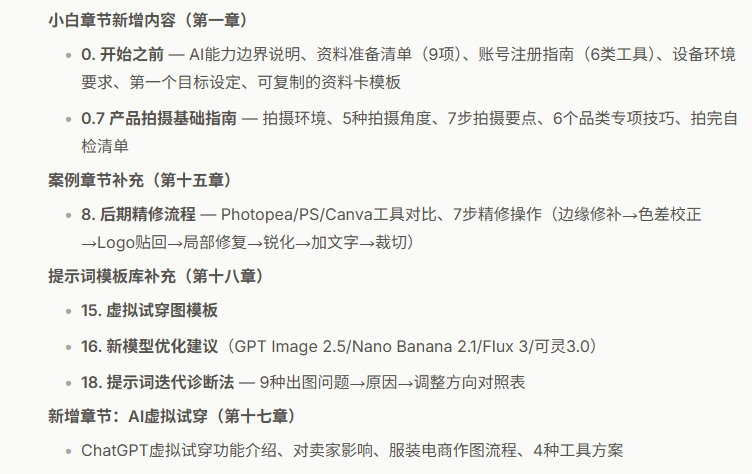
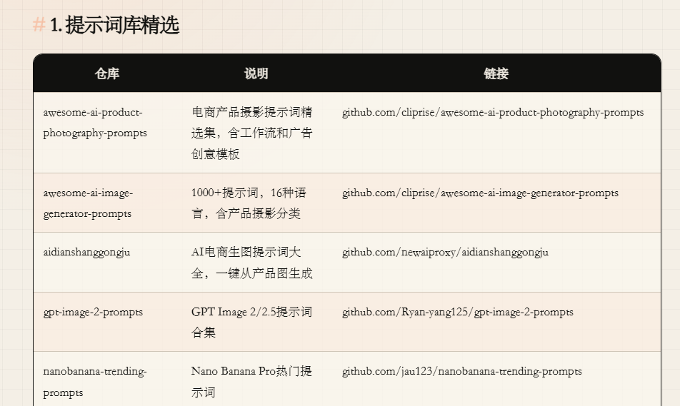
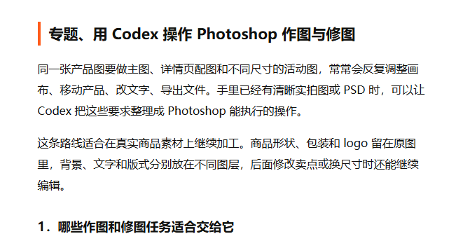
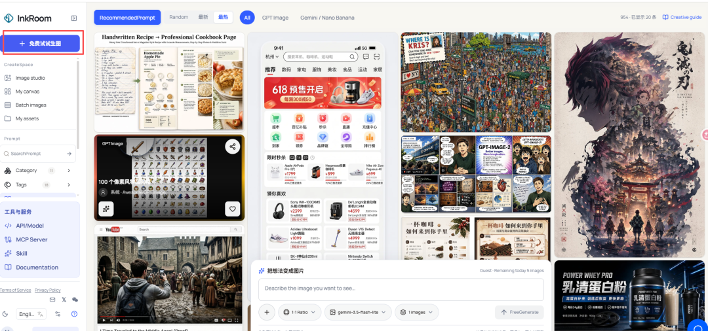

# 2026 最新版 电商 AI 作图 完整指南攻略3.0（附完整提示词和SOP）

> 作者：旺哥 · 公众号：AI应用实战派PRO  
> [查看微信公众号原文](https://mp.weixin.qq.com/s/6_RgkiHLtRJE4Ra1_Nk4Hw)
> [下载 HTML 图文包（含图片）](https://github.com/wangge-dev/wangge-articles/releases/download/html-archive/202610081745.zip) · [HTML 文件](../../html/2026/202610081745/article.html)

大家好呀，我是旺哥，6个月之前我整理过第一版作图攻略，

[ 给团队人员做的电商AI作图出图完整攻略（现免费分享给大家使用）总结版
](https://mp.weixin.qq.com/s?__biz=MzY4NDA4MDUwMA==&mid=2247483692&idx=1&sn=9e7c2f5f495d82233037395c1ed083b8&scene=21#wechat_redirect)

3个月之前整理过第二版作图攻略，当时GPT-image-2发布了不久

[ 2026最新版电商 AI 作图完整指南小白看这篇就行了（附完整提示词）
](https://mp.weixin.qq.com/s?__biz=MzY4NDA4MDUwMA==&mid=2247484450&idx=1&sn=ed42e1f1429a6bf6b2b678d067dc70f6&scene=21#wechat_redirect)

由于AI发展太快，现在GPT  -image-2.5都更新了一个月了，  咱们这个作图攻略当然也要跟上进度了，我结合日常使用经验以及群聊总结，借助
Codex 再次更新了本攻略，本次新增内容有：

章节

其他：

而且还有提示词库的更新:

[ 分享一个最新开源GPT-image-2.5 提示词库 电商/海报/人物全都有（每日持续更新）
](https://mp.weixin.qq.com/s?__biz=MzY4NDA4MDUwMA==&mid=2247485294&idx=1&sn=8ce618f5a8421c87e14c8d4f90d02974&scene=21#wechat_redirect)

[ 分享一个 27.3K Star 开源 GPT-Image-2 提示词库 ：500+ 案例,20+ 模板以及 Skill（商品图/海报/动漫）
](https://mp.weixin.qq.com/s?__biz=MzY4NDA4MDUwMA==&mid=2247485021&idx=1&sn=9656268ab448e5a534c1311fe23cf6af&scene=21#wechat_redirect)

以及专题：  用 Codex 操作 Photoshop 作图与修图

文章很长，如果没有耐心读下去，直接复制文章 Ctrl+A 到  Codex/Workbuddy 对话框就行！

如果需要快速批量出图推荐这

room.ai/

快速导航：按你的角色和任务跳章节，下面开始

完全小白

你要做什么：第一次用AI做电商图

直接跳到：一、小白先看 → 十四、案例

国内运营

你要做什么：做淘宝/京东/拼多多主图+详情页

直接跳到：二、按资料选流程 → 十一、合规 → 十三、SOP

Amazon卖家

你要做什么：做主图+A+图

直接跳到：十二、跨境方案 → 十六、A+图方案

Shopee卖家

你要做什么：做促销图+详情图

直接跳到：十二、跨境方案 → 十八、提示词模板

Shopify独立站

你要做什么：做品牌视觉+Banner

直接跳到：十二、跨境方案 → 十四、案例

服装卖家

你要做什么：做模特图/试穿图

直接跳到：十七、虚拟试穿 → 十八、提示词模板

设计师

你要做什么：进阶工作流/批量出图

直接跳到：十、ComfyUI → 九、GitHub资源

老板/团队负责人

你要做什么：搭SOP/管团队

直接跳到：十三、SOP → 二十、团队路线

有开发能力

你要做什么：接API批量出图

直接跳到：五、API说明 → 六、Codex/Agent

* * *

目录

1．小白先看：电商AI作图从哪里开始

2．你现在手上有什么资料，就按什么流程做

3．AI能做哪些电商图

4．三种路线：网站版、工具版、API版

5．API、API Key、订阅会员和额度说明

6．Codex/Agent在电商作图里到底负责什么

专题：用 Codex 操作 Photoshop 作图与修图

7．主流模型与工具选择

8．AI电商作图专题平台

9．GitHub提示词库与开源资源

10．ComfyUI电商工作流专区

11．国内电商平台AI图合规边界

12．跨境平台方案：Amazon、Shopee、Shopify

13．标准电商AI作图SOP

14．各平台图片规格速查表

15．从一张产品图到完整详情页案例

16．Amazon A+图AI辅助方案

17．AI虚拟试穿与服装电商

18．电商AI作图提示词模板库

19．质检清单与常见问题

20．新手与团队上手路线

* * *

一、小白先看：电商AI作图从哪里开始

很多电商小白卡住，不是因为AI工具不够多，而是因为不知道第一步该做什么。

如果你是新手，不要一开始研究API、ComfyUI、模型参数、工作流节点。先跑通一张图。

但在跑通之前，有几件前置事项必须先准备好。否则你打开工具也不知道该上传什么、输入什么。

0．开始之前：你需要准备什么

0.1 先搞清楚：AI作图在你的流程里负责什么

AI不是万能美工。在电商作图流程中，AI通常负责：

✅ 换背景、生成场景

✅ 统一光影和色调

✅ 扩图、裁切适配多尺寸

✅ 批量生成候选图

✅ 辅助卖点视觉化

AI不擅长或不能直接做的：

❌ 凭空生成一个逼真的正式产品主图（必须基于真实产品图）

❌ 生成准确的中文长文（文字必须后期排版）

❌ 生成真实认证标识、检测数据

❌ 替代人工判断产品是否失真、是否合规

理解了这个边界，后面才知道哪些环节用AI、哪些环节必须人工。

0.2 资料准备：你需要提前整理这些东西

在打开任何AI作图工具之前，先准备好以下资料。没有这些，你连提示词都写不出来。

产品实拍图/白底图

说明：至少1张清晰的产品照片，白底最佳，手机拍也行但要清晰

必须/可选：必须

产品名称和基础信息

说明：名称、颜色、材质、尺寸、重量

必须/可选：必须

核心卖点3-5条

说明：用文字列出你最想表达的卖点，如"无线充电""食品级材质"

必须/可选：必须

目标平台

说明：淘宝/Amazon/Shopee/Shopify等，不同平台图片规范和风格不同

必须/可选：必须

目标人群

说明：如"25-35岁上班族""健身人群""宝妈"，影响场景和风格选择

必须/可选：建议有

竞品参考图

说明：3-5张竞品链接或截图，参考构图和风格（不是照搬）

必须/可选：建议有

品牌风格关键词

说明：如"简约""清新""科技感""高端"，用于统一视觉方向

必须/可选：建议有

logo源文件

说明：如果需要后期加logo，准备PNG透明底或矢量文件

必须/可选：可选

平台图片规范

说明：目标平台对主图、详情页的尺寸和要求（后面章节有整理）

必须/可选：可选

建议用一个简单的文档或表格整理好，后面写提示词、出图、质检都要反复对照。

0.3 账号准备：这些工具先注册好

不用一次全注册。按你的需求选2-3个就够起步。

写提示词/提炼卖点

推荐工具：ChatGPT / 豆包 / Kimi / 通义千问

是否免费：有免费额度

注册方式：官网注册，手机号即可

AI生图（中文友好）

推荐工具：即梦AI / 豆包 / 通义万相 / 可灵AI

是否免费：有免费额度

注册方式：官网/App注册

AI生图（跨境/英文）

推荐工具：ChatGPT（GPT Image 2.5）/ Krea / Midjourney

是否免费：ChatGPT有免费额度，其余付费

注册方式：官网注册，部分需梯子

抠图/换背景

推荐工具：Pic Copilot / remove.bg / 美图设计室

是否免费：有免费功能

注册方式：官网注册

排版/加文字/详情页

推荐工具：Canva / 创客贴 / 美图设计室

是否免费：有免费模板

注册方式：官网注册

电商专用AI商拍

推荐工具：WeShop唯象 / 达笔 / AI商拍DesignKit

是否免费：部分免费试用

注册方式：官网注册

注册建议：

1．先用免费额度测试，不要一上来就买会员

2．用同一个邮箱注册，方便管理

3．跨境工具如果需要梯子，提前确认网络环境稳定

4．注册完不要急着研究功能，先跳到"最短路径"跑通一张图再说

0.4 设备和环境要求

网站版AI作图对设备要求不高，但以下几点注意：

✅ 一台能流畅浏览网页的电脑（不需要高配显卡）

✅ 稳定的网络（AI生图需要上传下载，断网会中断）

✅ 建议用Chrome或Edge浏览器（兼容性最好）

✅ 显示器尽量用sRGB色域，避免色差导致产品颜色偏差

✅ 准备一个文件夹，按SKU建子文件夹，存放产品图、生成图、终稿

如果你后续要用ComfyUI等本地工具，才需要考虑显卡（建议8GB显存以上）。起步阶段用网站版完全够用。

0.5 确认你的第一个目标

在开始之前，想清楚你这次要做什么。不要一上来就想"做一套完整的详情页"。

建议第一个目标定为：

用1个产品，生成3张图：

1张白底/干净背景图

1张场景图

1张加了卖点文字的成品图

目标不是完美，是跑通流程。

跑通之后，你就知道：提示词怎么写、AI哪里容易出错、后期要补什么、质检看什么。这比看10篇教程都有用。

0.6 资料准备清单（可复制）

复制下面这个清单，每次做新产品图时对照填写：

【产品AI作图资料卡】

产品名称：

产品颜色：

产品材质：

产品尺寸/重量：

核心卖点（3-5条）：

1．

2．

3．

目标平台：

目标人群：

品牌风格关键词：

竞品参考（链接或截图）：

产品图存放路径：

是否需要logo：是/否

禁止夸大的内容：

填完这张卡，你就可以进入下面的正式流程了。

0.7 产品拍摄基础指南（手机就够）

AI作图的质量上限，很大程度取决于你上传的产品图质量。输入糊，输出也糊。这一节教你用手机拍出适合AI处理的产品图。

拍摄环境

✅ 光线：优先自然光（靠窗位置），避免直射阳光造成硬阴影

✅ 背景：纯白墙/白纸/白布，或干净的纯色背景

✅ 桌面：平整、干净、无反光材质（避免玻璃桌面）

✅ 避免混合光源（同时开日光灯+阳光会导致色温混乱）

拍摄角度建议

正面平拍

适合品类：包装类、平面产品

说明：镜头与产品正面平行，展示包装正面

45度俯拍

适合品类：大多数产品

说明：最通用的电商角度，立体感好

正俯拍（平铺）

适合品类：服装、食品、套装

说明：从上往下拍，适合展示全貌

侧面

适合品类：瓶罐、杯壶

说明：展示产品轮廓和厚度

多角度组合

适合品类：高客单价产品

说明：拍4-6个角度，方便AI生成不同视角

拍摄要点

1．擦干净产品（指纹、灰尘在高清下很明显）

2．手机开启HDR，关闭美颜/滤镜

3．对焦到产品主体，手动点击屏幕对焦

4．保持镜头稳定（双手持机或用支架）

5．拍完立即检查：边缘是否清晰、颜色是否接近实物、logo是否可读

6．同一产品拍3-5张不同角度，选最好的1-2张作为主参考图

不同品类的拍摄技巧

反光产品（金属、玻璃）

拍摄要点：用柔光布/白纸挡一下直射光，避免强反光

常见坑：反光过曝→AI无法还原材质

黑色/深色产品

拍摄要点：需要更多光线，注意边缘轮廓

常见坑：暗部细节丢失→AI补出来的细节是假的

透明产品（瓶子、杯子）

拍摄要点：背景放一张白纸增加轮廓感

常见坑：透明物体抠图困难

服装/布艺

拍摄要点：熨平褶皱，平铺或挂拍

常见坑：褶皱严重→AI生成的模特图也会歪

小件产品（耳环、戒指）

拍摄要点：用微距模式或靠近拍摄，放硬币做比例参考

常见坑：太小看不清细节

食品

拍摄要点：新鲜食材做点缀，拍完尽快（食物会塌）

常见坑：颜色偏差→看起来不新鲜

拍完自检清单

☐ 产品边缘是否清晰（没有模糊/重影）

☐ 颜色是否接近实物（和实物放在一起对比）

☐ logo和包装文字是否可读

☐ 背景是否干净（越干净，AI换背景越准）

☐ 产品是否完整（没有被裁掉边角）

☐ 图片分辨率是否够大（建议至少2000x2000px）

☐ 没有强烈反光或过曝区域

拍好这一步，后面AI出图的成功率会大幅提升。如果产品图本身模糊、变形、颜色偏差严重，再好的AI工具也救不回来。

* * *

1．最短路径

真实产品图 → 抠图/白底图 → AI换背景/生成场景图 → Canva/创客贴加文字 → 人工质检 → 导出平台尺寸

2．小白第一张图怎么做

第一步：准备一张真实产品图

优先级：

清晰白底图 > 影棚产品图 > 手机拍摄清晰图 > 竞品参考图 > 只有文字卖点

注意：正式上架图尽量基于真实产品图，不建议纯靠文字让AI“凭空画一个商品”。

第二步：先做干净产品图

推荐工具：

• Pic Copilot

• 美图设计室

• 创客贴

• Canva

• remove.bg 类抠图工具

目标：

产品边缘干净，背景简洁，颜色接近实物，logo和包装文字清晰。

第三步：生成3张场景图

一开始不要生成几十张。先生成3张：

1张白底/浅色背景

1张生活方式场景图

1张高端质感图

第四步：用Canva/创客贴加文字

不要让AI直接生成中文标题、卖点、参数表。中文容易乱码，建议后期排版。

第五步：人工检查

重点检查：

产品形状有没有变

颜色有没有偏

logo有没有错

包装文字有没有乱

材质有没有被AI美化过头

是否暗示了不存在的功能

第六步：导出尺寸

常见尺寸：

1:1 主图

3:4 竖图

4:5 移动端/社媒图

16:9 Banner

详情页长图

Amazon A+模块图

3．小白最低成本工具组合

写提示词/提炼卖点

低成本组合：ChatGPT、豆包、通义、Kimi等文本工具

抠图/换背景

低成本组合：Pic Copilot、美图设计室、创客贴、Canva

中文场景图

低成本组合：即梦AI、豆包、通义万相

排版详情页

低成本组合：Canva、创客贴、美图设计室

跨境品牌图

低成本组合：ChatGPT图像能力、Krea、Canva

A+图草图

低成本组合：ChatGPT图像能力、Canva、PS

4．小白不要一开始做什么

不要一开始上API。

不要一开始装复杂本地工作流。

不要纯文字生成正式产品主图。

不要让AI直接生成中文详情页长文。

不要照搬竞品图。

不要跳过人工质检。

* * *

二、你现在手上有什么资料，就按什么流程做

1．有清晰产品白底图

这是最理想的情况。

流程：

白底图 → 换背景 → 场景图 → 卖点图 → 详情页排版 → 质检

推荐工具：Pic Copilot、美图设计室、即梦、豆包、通义万相、Canva。

重点：保持产品主体不变，只改背景、光线和场景。

2．有手机随手拍产品图

流程：

手机图 → 裁切矫正 → 抠图 → 清洁背景 → 调整亮度色彩 → AI生成场景图

注意：手机图如果模糊、反光严重、角度变形，AI后续也很难稳定。

3．有竞品参考图

竞品图只能参考：

• 构图；

• 卖点表达；

• 颜色风格；

• 场景方向；

• 页面结构。

不能做：

直接复制竞品图

照搬竞品文案

复刻对方模特/场景/品牌元素

把竞品图当成自己的产品图上传生成

正确流程：

竞品图 → 提炼风格和结构 → 用自己产品图重新生成 → 后期排版自己的卖点

4．只有产品卖点，没有图片

可以先做视觉方案，但不能直接当正式上架图。

流程：

产品卖点 → 详情页结构 → 画面脚本 → 等真实产品图到位 → 再生成正式图片

适合提前准备：

• 详情页结构；

• 主图卖点；

• 场景方向；

• 拍摄清单；

• 提示词模板。

5．有一批SKU

不要每个SKU重新想。先做模板。

流程：

选3个代表SKU → 跑通风格 → 固定提示词 → 批量替换产品图 → 统一质检

重点：统一背景、光线、构图、命名规则。

6．做Amazon

主图：真实白底图优先，AI只做轻修。

副图/A+图：AI可以做场景和品牌氛围。

7．做Shopee

主图可更促销化，但产品必须清楚。

多语言文字后期添加，避免AI乱码。

8．做Shopify独立站

先定品牌视觉，再做产品图。

重点是统一色调、光线、构图和页面氛围。

* * *

三、AI能做哪些电商图

白底主图

AI适合度：高

建议：用真实图抠图和清洁背景，不建议纯AI重画产品

场景图

AI适合度：高

建议：最适合AI发挥，上传产品图后换场景

详情页配图

AI适合度：高

建议：AI出图，Canva/PS/创客贴排版文字

Amazon A+图

AI适合度：中高

建议：AI做氛围和模块配图，参数和声明人工确认

Banner海报

AI适合度：高

建议：AI做背景和主视觉，文字后期添加

服装模特图

AI适合度：中高

建议：必须检查版型、颜色、尺寸和模特姿势

尺寸图

AI适合度：中

建议：AI做干净产品图，尺寸线和数字人工加

对比图

AI适合度：中

建议：AI做视觉底图，对比数据人工确认

包装文字图

AI适合度：低

建议：不建议让AI重画包装文字

核心原则

主图越接近平台审核核心位置，越要真实保守。

详情页、A+图、Banner可以更有场景和品牌感。

AI最适合做的事

• 换背景；

• 生成场景；

• 统一光影；

• 扩图；

• 生成详情页视觉草图；

• 生成Banner背景；

• 批量生成候选图；

• 辅助卖点视觉化。

AI不适合直接做的事

• 凭空生成正式主图产品；

• 生成准确中文长文；

• 生成真实认证标识；

• 编造检测数据；

• 替代人工判断平台合规；

• 替代人工审核。

* * *

四、三种路线：网站版、工具版、API版

1．网站版：小白优先

适合：运营、老板、小团队、没有技术背景的人。

流程：

打开网站 → 上传产品图 → 选择模板或输入提示词 → 生成 → 下载 → 后期排版

优点：上手快。  
缺点：批量能力和风格控制有限。

2．工具版：设计师和进阶团队

适合：设计师、素材团队、需要固定风格和批量处理的人。

常见工具：

• ComfyUI；

• Photoshop + Firefly；

• Stable Diffusion / Flux工作流；

• 批量裁切、压缩、重命名工具；

• Codex/Agent辅助整理提示词和素材。

优点：控制力强。  
缺点：学习成本更高。

3．API版：有技术能力再上

适合：SKU多、有开发人员、需要接商品库或素材库的团队。

流程：

商品资料 → 产品图 → 调用图像API → 生成候选图 → 裁切 → 人工审核 → 素材归档

优点：适合批量。  
缺点：需要开发，费用独立计算。

4．怎么选

完全小白

建议路线：网站版

每周做少量图

建议路线：网站版 + Canva

有设计师

建议路线：网站版 + PS/ComfyUI

SKU很多

建议路线：工具版或API版

做Amazon主图

建议路线：真实图 + 轻修

做A+图/独立站

建议路线：AI场景图 + 人工排版

想低成本试错

建议路线：先用免费额度和网站版

* * *

五、API、API Key、订阅会员和额度说明

很多小白会误会：开了会员就能免费用API。通常不是。

1．几个概念

免费版

解释：平台给的体验额度

小白注意：适合测试，不适合稳定生产

账号订阅/会员

解释：网页或App里的付费权益

小白注意：不等于API免费

积分包

解释：按生成次数或算力扣费

小白注意：注意高清、重绘、放大也可能扣费

API Key

解释：程序调用接口的钥匙

小白注意：不要泄露，不要写在公开网页里

官方API

解释：模型官方接口

小白注意：稳定性相对更好，通常按量计费

第三方聚合/API中转

解释：一个接口接多个模型

小白注意：成本、稳定性、合规和数据安全要评估

2．订阅会员和API的区别

使用方式

订阅会员：网页/App手动使用

API：程序调用

面向对象

订阅会员：普通用户

API：开发者/系统团队

计费

订阅会员：月费/会员/积分

API：按调用量、图片数、模型规格计费

批量能力

订阅会员：有限制

API：更适合批量

是否需要开发

订阅会员：不需要

API：通常需要

常见误区

订阅会员：会员等于API免费

API：实际通常另算钱

3．小白建议

先别买API。

先用网站版跑通一个产品。

确认一套产品大概要生成多少张图、返工几次、哪些图能用。

再评估API成本。

4．API安全提醒

不要把API Key发到微信群。

不要交给不可信外包。

不要写进前端代码。

设置用量上限。

保留提示词、模型、生成时间和图片记录。

* * *

六、Codex/Agent在电商作图里到底负责什么

群里常见问题是：“怎么用Codex做主图和A+详情图？”

先讲清楚：Codex不是传统生图网站。它更像一个能帮你整理资料、写提示词、处理文件、设计流程、调用工具的工作助手。

1．Codex适合做什么

• 提炼产品卖点；

• 生成主图提示词；

• 生成详情页结构；

• 生成Amazon A+图模块方案；

• 按SKU批量生成提示词；

• 整理图片命名规则；

• 生成批量裁切、压缩、重命名脚本；

• 协助接图像API；

• 生成质检清单；

• 把竞品图拆解成构图和卖点参考。

2．Codex不等于什么

不等于一键生图网站。

不等于电商平台后台。

不等于上架工具。

不等于保证转化的工具。

不等于替代人工审核的工具。

3．Codex + 生图工具的正确组合

产品资料表 → Codex提炼卖点 → Codex生成提示词 → 生图网站/API出图 → Canva/PS排版 → Codex生成质检表 → 人工审核

4．一个实用例子

你可以让Codex先做这个：

请根据下面产品资料，帮我生成：

1．5条电商卖点；

2．3个主图方向；

3．5张详情页配图提示词；

4．1套Amazon A+模块结构；

5．上架前图片质检清单。

产品资料：

[粘贴产品名称、材质、颜色、尺寸、卖点、目标平台]

然后把生成的提示词拿到ChatGPT图像能力、即梦、豆包、通义万相、Pic Copilot、Krea、Canva等工具里出图。

* * *

专题、用 Codex 操作 Photoshop 作图与修图

同一张产品图要做主图、详情页配图和不同尺寸的活动图，常常会反复调整画布、移动产品、改文字、导出文件。手里已经有清晰实拍图或 PSD 时，可以让 Codex
把这些要求整理成 Photoshop 能执行的操作。

这条路线适合在真实商品素材上继续加工。商品形状、包装和 logo 留在原图里，背景、文字和版式分别放在不同图层，后面修改卖点或换尺寸时还能继续编辑。

1．哪些作图和修图任务适合交给它

先从规则明确的任务开始。比如统一画布尺寸、按比例缩放和摆放商品、替换已确认的背景图、增加文字图层、整理图层名称，以及按指定格式另存和导出。Adobe 的
Photoshop 文档与图层接口提供了读取文档、操作图层、变换图层和保存文件等能力；实际可调用哪些操作，还要看使用的脚本类型和 Photoshop 版本。

已有分层 PSD 时，可以继续调整背景、产品位置、标题字号和边距。只有一张合成后的 JPG
时，背景和商品已经粘在一起，往往要先做好选区或蒙版。毛发、透明材质、镜面反射和商品边缘是否自然，仍要放大检查。

修图也要把任务说具体。“让这张图高级一点”很难检查结果；“保留产品原色，清理已标出的背景灰点，调整背景亮度，商品区域保持不变”更容易执行和验收。

2．Codex 怎样接到 Photoshop

先确认电脑上安装并能正常启动 Photoshop。如果 Codex 已经接入可用的 Photoshop
工具、插件或本机自动化接口，就让它按这些工具实际支持的操作执行，并返回成品路径。

暂时没有接入接口，也可以先用脚本方式。让 Codex 根据任务生成 Photoshop 脚本，你在 Photoshop 中通过“文件 → 脚本 →
浏览”选择文件运行。Adobe 官方说明支持 .js、.jsx 脚本；新版 UXP 脚本使用 .psjs 扩展名，UXP 脚本要求 Photoshop
23.5 或更新版本。两套脚本的接口不同，生成时要先选定一种，不能只改文件扩展名。

在这条入门路径里，Codex 负责写脚本和根据报错修正，Photoshop 执行图片操作。是否已经完成修图，要看 Photoshop 输出的文件和实际画面。

可以先给 Codex 这条指令，确认当前能走哪条路径。

我想用你操作本机 Photoshop 做电商图片。先确认当前可用的操作方式。

我的系统是[Windows/macOS]，Photoshop 版本是[填写版本]。

请检查你当前实际拥有的 Photoshop 工具、插件或自动化接口，说明能否读取文档、处理图层、保存 PSD 和导出图片。

如果可以执行，先做一个读取当前文档名称、画布尺寸和图层名称的小测试，不修改或保存原文件。

如果无法直接调用 Photoshop，请根据我的版本生成一个可从“文件 → 脚本 → 浏览”运行的只读测试脚本，并告诉我怎样运行。

读取测试完成后，再建议适合后续作图的脚本类型和执行方式。没有实际调用的操作，请明确标注未执行。

3．新手先做一张能继续编辑的商品图

先准备一张已经抠好的透明产品 PNG，或者产品与背景已分开的
PSD，再准备确认过的卖点文字。原素材单独存放，输出另建目录。这样第一轮可以集中检查排版和导出，不会同时卡在抠图、修边和接工具上。

下面以 1200×1200 像素的练习图说明操作，正式尺寸按目标平台和图片用途填写。把素材路径、输出路径和卖点补齐，再把这条任务交给 Codex。

请用 Photoshop 制作一张可编辑的商品图。

产品素材：[透明 PNG 或分层 PSD 的完整路径]

卖点文字：[粘贴已经确认的标题和卖点，最多三条]

输出目录：[填写新建的输出目录]

本次练习画布：1200×1200 像素，白色背景。

保留产品原有形状、比例、颜色、包装文字和 logo。商品按比例缩放，最长边不超过 900 像素；不要拉伸、补造配件或重画产品。

产品完整摆放在画布中，四周至少留 80 像素边距。标题和卖点排在剩余空白处，不能盖住商品或包装信息。

产品、背景、标题、卖点分别保留在不同图层，图层名称要能看懂。

只使用我给出的文字。需要字体时先列出可用字体；没有合适字体就说明情况，不用猜测的字体名称。

在输出目录另存商品图_v1.psd，并导出商品图_v1.png，不覆盖原文件。

如果当前没有 Photoshop 调用能力，就生成对应版本可运行的脚本和操作说明，由我在 Photoshop 中触发。

完成后报告实际生成的文件路径和画布尺寸，列出尚需人工检查的商品边缘、文字遮挡和颜色问题。

运行后先打开导出的图片，再打开 PSD 看图层。检查商品有没有被裁掉、文字能不能读、图层是否可单独编辑，以及输出尺寸是否正确。只收到脚本文件时，继续到
Photoshop 运行；不要把脚本文件当作成图。

4．修图时说明保留区域和修改区域

第一版构图已经合适，就围绕同一个 PSD
做局部修改。把要改的位置标在截图上，或者明确指出图层名称和区域。已有合适蒙版时尽量沿用蒙版，避免一次修改影响整个商品。

请在这份 PSD 的副本上做局部修图。

PSD 路径：[填写路径]

参考截图：[提供标注过的截图]

这次修改：[填写具体位置和问题，例如背景右上角有灰点、标题距上边太近]

必须保留：[列出产品图层、商品颜色、包装文字、logo、构图或已有文字]

输出目录：[填写路径]

先读取图层结构，确认标注区域和可用蒙版。只修改指定区域，不能重新生成整张产品图。

需要修边或清理局部污点时，先说明可执行的方法；商品区域没有可靠选区或蒙版时，请指出需要我补充的选区，不猜测边界。

修图尽量放在独立图层或副本中，保留原产品图层。

另存商品图_v2.psd，导出商品图_v2.png，并说明相对 v1 实际修改了什么。

无法调用 Photoshop 时提供脚本或人工操作步骤；没有运行的部分不要写成已经完成。

商品色差不要凭“更鲜艳”来判断。对照原始实拍或确认过的色卡，检查材质、反光和包装细节。图看起来更干净，也要确认没有把真实结构、必要标识或商品瑕疵信息错误抹掉。

5．做稳一张，再考虑批量

一张图的素材、脚本和输出检查都跑通后，再把同类商品接到同一套版式。批量任务要写清输入目录、图层命名、尺寸、文字来源和输出命名，并先抽两三张查看。某张图片缺素材、文字太长或产品放不下时，单独列出来处理。

* * *

七、主流模型与工具选择

1．模型选择

GPT Image 2.5 (Flare/Sunburst)

适合场景：对话式改图、4K输出、草图工具、多轮编辑、虚拟试穿

注意点：DALL-E已退役，完全替代为GPT Image 2.5

Nano Banana 2.1

适合场景：产品图编辑、多参考图一致性（最多14张）、文字渲染准确率94%、4K输出

注意点：API降价50%，支持宽全景

Flux 3 Image

适合场景：JSON边界框布局、像素级精准编辑、4K输出、单端点生成+编辑

注意点：适合需要精准控制的电商场景

Midjourney V8.2

适合场景：高级海报、品牌氛围、Edit Model、Draft Mode（24张候选图/次）

注意点：精准产品还原仍需谨慎

Stable Diffusion 4

适合场景：开源、12B参数、4096像素输出、社区许可

注意点：适合本地部署和自定义工作流

Ideogram 4.5

适合场景：精准编辑、重复编辑不偏移、文字渲染锐利

注意点：适合需要多次迭代的产品图

可灵3.0 (Kling)

适合场景：电商Agent模式、一键产品图组+短视频、主体参考、4K直出

注意点：国内电商首选之一

通义万相 Wan 2.7

适合场景：中文语义、国内审美、Wan 3.0视频支持文档输入

注意点：产品细节仍需参考图约束

即梦AI (Jimeng)

适合场景：中文场景图、扩图、图像编辑、视频生成

注意点：字节系生态

> DALL-E 3 API已于2026年5月12日退役，DALL-E GPT于2026年8月30日退役。原DALL-E用户请迁移至GPT Image
> 2.5。

2．网站版工具

> 网址可能随平台改版调整；使用前以平台官网当前入口和服务条款为准。

ChatGPT / GPT Image 2.5

官网/入口：chatgpt.com

最适合：对话式改图、4K输出、草图工具、虚拟试穿、多轮编辑

不适合：大批量低成本流水线

适合人群：运营、老板、设计师

即梦AI

官网/入口：jimeng.jianying.com

最适合：中文场景图、扩图、图像编辑

不适合：严格产品结构还原

适合人群：国内运营

豆包

官网/入口：doubao.com

最适合：快速灵感、中文对话修图

不适合：高强度批量生产

适合人群：小白、运营

通义万相

官网/入口：tongyi.aliyun.com/wanxiang

最适合：中文文生图/图生图

不适合：完整详情页排版

适合人群：淘系/中文用户

Canva

官网/入口：canva.cn

最适合：详情页、Banner、社媒排版

不适合：精准产品重绘

适合人群：运营、设计助理

Liblib

官网/入口：liblib.art

最适合：模型、工作流、创意图

不适合：完全小白一步成图

适合人群：设计师、进阶用户

达笔

官网/入口：dabids.cn

最适合：电商设计、商品图、营销图

不适合：深度系统集成

适合人群：国内电商团队

Pic Copilot

官网/入口：piccopilot.com/zh

最适合：商品换背景、主图、AI模特

不适合：极复杂创意控制

适合人群：小白、跨境卖家

美图设计室

官网/入口：designkit.cn

最适合：商拍、批量商品图、营销设计

不适合：高度自定义工作流

适合人群：运营/设计团队

创客贴

官网/入口：chuangkit.com

最适合：抠图、排版、海报、详情页

不适合：精准模型控制

适合人群：国内电商运营

Krea

官网/入口：krea.ai

最适合：多模型创意、高清放大、品牌视觉

不适合：纯中文小白可能有门槛

适合人群：独立站/设计师

TapNow

官网/入口：app.tapnow.ai

最适合：多模型聚合、工作流创作

不适合：只想一键白底图

适合人群：进阶团队

3．其他常用入口补充

图像API

工具/平台：OpenAI Images API

官网/入口：platform.openai.com/docs/guides/images

适合用途：开发者接入图像生成/编辑能力

图像模型入口

工具/平台：Google Gemini

官网/入口：gemini.google.com

适合用途：使用Google系图像能力的网页入口

图像开发入口

工具/平台：Google AI Studio

官网/入口：aistudio.google.com

适合用途：测试Google系模型/API能力

高级审美图

工具/平台：Midjourney

官网/入口：midjourney.com

适合用途：品牌海报、创意氛围图、风格参考

Adobe编辑

工具/平台：Adobe Firefly

官网/入口：firefly.adobe.com

适合用途：PS生态、扩图、局部编辑、商用设计

开源工作流

工具/平台：ComfyUI

官网/入口：github.com/comfyanonymous/ComfyUI

适合用途：本地/云端节点式批量作图工作流

开源模型

工具/平台：Black Forest Labs / Flux

官网/入口：blackforestlabs.ai

适合用途：Flux模型信息和生态入口

抠图工具

工具/平台：remove.bg

官网/入口：remove.bg

适合用途：快速抠图、透明背景

设计排版

工具/平台：Canva国际版

官网/入口：canva.com

适合用途：跨境团队、英文素材、海外模板

4．低成本玩家怎么选

0预算试错

建议组合：国产AI免费额度 + Pic Copilot/Canva免费功能

低预算

建议组合：一个常用生图会员 + Canva/创客贴会员

中预算

建议组合：Krea/TapNow/Midjourney/美图设计室等组合

团队预算

建议组合：网站版验证 + 工具版固定流程 + API处理高频SKU

5．不同目标的推荐组合

国内小团队

Pic Copilot/美图设计室 → 主图和换背景

即梦/豆包/通义万相 → 场景图和创意图

Canva/创客贴 → 详情页排版

Amazon卖家

真实产品图 → 白底主图轻修

ChatGPT/Krea/Canva → A+图视觉和品牌模块

PS/人工审核 → 确保产品真实和规范

Shopify独立站

GPT Image 2.5/Nano Banana 2.1/Krea → 品牌生活方式图

Canva/PS → Banner和产品页排版

统一品牌词库 → 保持视觉一致

* * *

八、AI电商作图专题平台

除了通用AI作图工具，市面上已经出现一批专门服务电商的垂直作图平台。这些平台通常提供：一键换背景、AI模特、产品场景图批量生成、电商模板等针对性功能。

1．国内电商专题平台

WeShop唯象

官网：weshop.com

核心功能：AI商拍，无需模特/影棚，上传产品图即可生成模特图和场景图

适合谁：服装、配饰卖家

知衣科技FD+

官网：zhiyitech.cn

核心功能：AI服装设计+商拍全链路，从设计稿到产品图

适合谁：服装品牌/设计师

AI商拍DesignKit

官网：designkit.cn/aicp

核心功能：AI商品图生成，批量换背景

适合谁：国内电商运营

堆友AI

官网：duiyou.com

核心功能：电商AI设计，丰富模板

适合谁：国内运营/设计

美梦AI

官网：-

核心功能：电商主图生成

适合谁：小团队

2．跨境电商专题平台

Photta

官网：photta.app

核心功能：AI产品摄影，5种风格预设

适合谁：跨境卖家

1min.ai

官网：1min.ai

核心功能：免费AI电商图生成器

适合谁：低预算卖家

Claid.ai

官网：claid.ai

核心功能：AI生活方式图生成，时尚内容制作

适合谁：品牌团队

Auratuner

官网：auratuner.com

核心功能：AI产品背景替换，漂移检测

适合谁：进阶用户

Skild Art

官网：-

核心功能：跨境电商AI视觉平台，1000+场景风格

适合谁：跨境团队

3．怎么选

小白/小团队：先用WeShop/Pic Copilot做基础产品图，再用通用工具做创意图

跨境团队：Photta/1min.ai快速出图 + Canva排版

品牌团队：Claid.ai + Krea + 品牌视觉规范

* * *

九、GitHub提示词库与开源资源

GitHub上有大量社区维护的电商AI作图提示词库和开源工具，可以大幅提升效率。

1．提示词库精选

awesome-ai-product-photography-prompts

说明：电商产品摄影提示词精选集，含工作流和广告创意模板

链接：github.com/cliprise/awesome-ai-product-photography-prompts

awesome-ai-image-generator-prompts

说明：1000+提示词，16种语言，含产品摄影分类

链接：github.com/cliprise/awesome-ai-image-generator-prompts

aidianshanggongju

说明：AI电商生图提示词大全，一键从产品图生成

链接：github.com/newaiproxy/aidianshanggongju

gpt-image-2-prompts

说明：GPT Image 2/2.5提示词合集

链接：github.com/Ryan-yang125/gpt-image-2-prompts

nanobanana-trending-prompts

说明：Nano Banana Pro热门提示词

链接：github.com/jau123/nanobanana-trending-prompts

AI Image Prompt Engineering Cheat Sheet

说明：跨模型提示词参考（2026年2月更新）

链接：gist.github.com/horushe93/046d7e9882ecdf13335ff2108e89e135

2．电商开源工具

Fashion-AI

说明：电商AI生图爆款流水线：平铺图→模特图，使用embedding API

链接：github.com/liangdabiao/Fashion-AI

product-poster-ai

说明：电商商品AI海报生成：产品属性识别+AI提示词生成，支持参考图

链接：github.com/chaochaoji/product-poster-ai

ecommerce-image-suite

说明：电商套图生成助手：完整电商图组生成+卖点分析

链接：github.com/wzj177/ecommerce-image-suite

banana-mall (MxPage)

说明：开源AI电商详情页生成器：上传产品参考图，自动分析卖点

链接：github.com/ziguishian/banana-mall

Photoshoot

说明：零提示词AI产品照生成器：提取参考模板，100%产品细节保留

链接：github.com/ruanyf/weekly/issues/9559

Lovimg

说明：AI图像提示词库，带预览图，可搜索

链接：github.com/ruanyf/weekly/issues/10066

3．使用建议

先Star收藏，按自己品类筛选提示词

下载后根据自己产品修改变量（颜色、场景、材质）

开源工具注意查看License，确认商用许可

提示词库是起点，不是终点——需要根据实际出图效果持续调优

* * *

十、ComfyUI电商工作流专区

ComfyUI是进阶用户和设计师的首选节点式工作流工具。以下是目前社区中已验证的电商相关工作流。

1．现成电商工作流模板

虚拟试穿4合1

说明：人物+服装平铺→Nano Banana Pro试穿效果

来源：comfy.org官方模板

完美换装4K

说明：AI换装+服装转移，自动/手动蒙版，4K支持

来源：LiblibAI

电商服装换装+产品换背景

说明：一站式服装自定义换装和产品背景替换

来源：RunningHub

一键换装

说明：零成本模特方案

来源：RunningHub AI

电商产品精修+模特换装+换背景

说明：三合一工作流

来源：B站教程

Flux一键换装

说明：基于Flux的电商必备换装流程

来源：知乎

2．核心技术组件

ControlNet

用途：精确控制姿势、布局、轮廓

电商场景：模特姿势控制、产品轮廓约束

IP-Adapter

用途：喂入参考照片保持一致外观

电商场景：产品一致性、品牌风格统一

Multi-LoRA

用途：叠加多个LoRA实现复杂场景

电商场景：产品+场景+风格组合

Nano Banana 2.1 Subject Consistency

用途：最多14张参考图保持一致性

电商场景：多角度产品图、系列产品

3．本地部署建议

ComfyUI + Flux本地部署需要至少8GB显存的GPU

云端方案：RunningHub、LiblibAI提供在线ComfyUI工作流运行

新手建议先用云端模板跑通，再考虑本地部署

本地部署教程参考：tech-insider.org/comfyui-tutorial-flux-1-local-setup-2026/

* * *

十一、国内电商平台AI图合规边界

覆盖：淘宝、天猫、京东、拼多多、抖音电商、小红书电商。

1．会不会因为AI图被处罚？

更准确的说法是：平台关注的通常不是“是不是AI生成”，而是：

是否虚假宣传

是否商品不一致

是否误导消费者

是否侵权

是否低质/违规营销

是否使用未授权品牌元素或认证标识

所以不要把AI图理解成天然违规，也不要把AI当成免责工具。

2．风险最高的AI图

产品被改形

例子：杯子多了按钮，耳机多了接口

颜色被美化

例子：实物灰白，AI做成珠光白

材质被升级

例子：塑料变玻璃，PU变真皮

功效夸大

例子：普通清洁用品做成“瞬间除菌99.99%”

虚假认证

例子：生成未授权检测标、奖章、平台标识

包装文字乱码

例子：品牌名、规格、成分被AI改错

尺寸误导

例子：小件商品被放得像大件

侵权风险

例子：生成相似明星、品牌、IP元素

3．主图安全做法

产品主体真实。

背景简洁。

促销文字后期添加。

不要过度特效。

不要暗示不存在的配件。

4．详情页安全做法

AI做场景和视觉。

参数、材质、尺寸、检测数据必须人工填写。

对比图不能捏造竞品数据。

效果图避免绝对化表达。

5．人工审核清单

☐ 产品主体是否与实物一致

☐ 颜色是否准确

☐ 材质是否真实

☐ logo和包装文字是否正确

☐ 是否出现未授权品牌/IP

☐ 是否出现虚假认证或奖项

☐ 功能表现是否有依据

☐ 尺寸比例是否误导

☐ 中文文字是否后期排版且清晰

☐ 是否符合目标平台图片规范

* * *

十二、跨境平台方案：Amazon、Shopee、Shopify

1．Amazon

主图原则

Amazon主图要保守：

• 真实产品；

• 纯白背景；

• 产品完整清晰；

• 不加促销文字、徽章、夸张图标；

• 不放容易误导的道具；

• 长边建议至少1000px以上，方便缩放查看。

AI适合做什么

适合：

• 白底清洁；

• 去灰、去脏、轻微修瑕；

• 副图生活方式场景；

• A+品牌图；

• 功能模块配图。

不建议：

• 纯AI生成主图产品；

• 加入不存在的配件；

• 生成虚假认证、奖项、测试数据；

• 把材质做得比实物高级。

2．Shopee

Shopee更偏转化和促销，但产品仍要清楚真实。

适合AI做：

• 促销背景；

• 场景副图；

• 节日活动图；

• 多语言卖点图的背景；

• 商品详情图。

注意：

多语言文字后期添加。

不要让促销元素盖住产品。

不要夸大发货物内容。

不同站点规则要单独核对。

3．Shopify独立站

Shopify重点是品牌一致性。

适合AI做：

• 首页Banner；

• 产品页生活方式图；

• 品牌故事图；

• 类目页头图；

• 邮件营销图；

• 广告落地图。

视觉原则：

统一色调 + 统一光线 + 统一构图 + 统一字体 + 统一场景风格

推荐流程：

确定品牌关键词 → 生成品牌场景图 → Canva/PS排版 → 导出桌面端和移动端尺寸 → 压缩图片 → 上传站点

* * *

十三、标准电商AI作图SOP

1．输入资料

产品名称

产品白底图/实拍图

颜色

材质

尺寸

核心卖点3-5条

目标平台

目标人群

价格带

竞品参考图

品牌风格关键词

禁止夸大的内容

2．输出素材

白底图

用途：平台主图、SKU展示

主图

用途：搜索和列表转化

场景图

用途：展示使用环境

细节图

用途：展示材质、结构、工艺

卖点图

用途：解释核心功能

尺寸图

用途：降低尺寸误解

对比图

用途：表达差异，但不能虚假比较

详情页长图

用途：国内平台详情页

A+图

用途：Amazon品牌内容

独立站Banner

用途：首页、产品页、广告落地页

Shopee促销图

用途：活动和列表转化

3．标准流程

资料准备

↓

确定平台策略

↓

选择工具

↓

生成提示词

↓

生成候选图

↓

筛选可用图

↓

后期排版文字

↓

多尺寸导出

↓

人工质检

↓

素材归档

4．图片命名规则

SKU_平台_图片类型_序号_日期

例：HB001_Amazon_Aplus_03_202607

* * *

十四、各平台图片规格速查表

做完了图，上传之前必须确认尺寸和格式。不同平台要求不同，这里整理了主流平台的核心规格。上传前对照一次，避免被压缩、裁切或拒审。

1．国内电商平台

淘宝/天猫

图片类型：主图

尺寸（px）：800×800 以上，建议1200×1200

格式/大小：JPG/PNG，≤3MB

要点：白底图更容易被搜索推荐

详情页

图片类型：宽750，高度不限（单张建议≤1500）

尺寸（px）：JPG，单张≤500KB

格式/大小：长图需分切，总高度不超过实际限制

SKU图

图片类型：800×800

尺寸（px）：JPG/PNG

格式/大小：颜色/规格差异要清晰可辨

京东

图片类型：主图

尺寸（px）：800×800 以上，建议1200×1200

格式/大小：JPG/PNG，≤5MB

要点：白底图优先，第一张必须白底

详情页

图片类型：宽750

尺寸（px）：JPG，单张≤1MB

格式/大小：图片总数建议不超过30张

主图视频

图片类型：与主图同比例

尺寸（px）：MP4，≤20MB，≤60秒

格式/大小：非必须但有权重加成

拼多多

图片类型：主图

尺寸（px）：750×750 以上

格式/大小：JPG，≤1MB

要点：第一张白底，不加促销文字

详情页

图片类型：宽750

尺寸（px）：JPG

格式/大小：简洁为主，移动端优先

抖音电商

图片类型：主图

尺寸（px）：600×600 以上，建议800×800

格式/大小：JPG/PNG

要点：第一张白底，风格偏年轻化

详情页

图片类型：宽750

尺寸（px）：JPG

格式/大小：短视频+图片混合效果更好

小红书

图片类型：商品图

尺寸（px）：1080×1440（3:4）或 1080×1080

格式/大小：JPG/PNG

要点：竖图效果更好，生活方式感

种草图

图片类型：1080×1440

尺寸（px）：JPG/PNG

格式/大小：真实感 > 精致感，避免过度AI痕迹

2．跨境电商平台

Amazon

图片类型：主图

尺寸（px）：至少1000×1000（长边），建议2000×2000

格式/大小：JPEG/PNG/TIFF/GIF，≤10MB

要点：纯白背景(RGB 255,255,255)，产品占画面85%以上，无文字/徽章/水印

副图

图片类型：同主图

尺寸（px）：同上

格式/大小：可做场景图、信息图、尺寸图、对比图

A+图

图片类型：按模块：标准970×600，精品970×300等

尺寸（px）：JPEG/PNG，≤300KB/张

格式/大小：需通过Brand Registry，模块尺寸严格

Shopee

图片类型：主图

尺寸（px）：800×800 以上，建议1000×1000

格式/大小：JPG/PNG，≤2MB

要点：不同站点要求略有差异，第一张不加文字

详情页

图片类型：宽750-1000

尺寸（px）：JPG

格式/大小：支持视频，图文混排

Shopify

图片类型：产品图

尺寸（px）：建议2048×2048（主题不同有差异）

格式/大小：JPG/PNG/WebP，≤20MB

要点：比例统一（建议1:1或3:4），同系列产品风格统一

Banner

图片类型：按主题，常见1920×600 或 1920×800

尺寸（px）：JPG/PNG/WebP

格式/大小：需同时准备桌面端和移动端尺寸

3．图片压缩与优化

图片太大→页面加载慢→跳出率高→影响排名。上传前必须压缩。

TinyPNG / TinyJPG

类型：在线免费

特点：智能压缩，视觉几乎无损，支持批量

链接：tinypng.com

Squoosh

类型：在线免费（Google出品）

特点：可实时对比压缩前后效果，支持WebP/AVIF

链接：squoosh.app

ImageOptim

类型：Mac本地免费

特点：批量压缩，自动去除EXIF等冗余数据

链接：imageoptim.com

Caesium

类型：Windows本地免费

特点：批量压缩，支持预览对比

链接：saerasoft.com/caesium

压缩建议

主图：保持高质量，压缩到500KB-1MB即可

详情页：每张控制在200-500KB

Banner：控制在300KB以内

格式选择：

• 通用场景用JPG（兼容性最好）

• 需要透明背景用PNG

• 独立站优先用WebP（体积比JPG小30%，但部分平台不支持）

• 不要上传原始PSD/TIFF到平台

压缩后务必检查：产品颜色是否偏移、边缘是否出现马赛克、文字是否模糊

* * *

十五、从一张产品图到完整详情页案例

案例产品：便携榨汁杯。

1．原始资料

产品：便携榨汁杯

颜色：奶油白、薄荷绿

材质：食品级杯体、不锈钢刀头

卖点：便携、无线充电、一杯一榨、易清洗、安全锁设计

目标平台：国内电商 + Shopify独立站

目标人群：上班族、健身人群、学生、轻食用户

风格：清新、健康、干净、生活方式

2．详情页结构

第1屏：主视觉海报

第2屏：核心卖点总览

第3屏：使用场景

第4屏：刀头/杯体细节

第5屏：便携尺寸说明

第6屏：清洗步骤

第7屏：安全锁设计

第8屏：颜色选择

第9屏：规格参数

第10屏：品牌/售后信息

3．主视觉图提示词

上传参考图，保持便携榨汁杯的外观、颜色、尺寸比例和logo完全一致。

将产品放置在明亮清新的厨房台面上，旁边有新鲜草莓、香蕉、蓝莓和一杯刚榨好的果昔。

整体为奶油白和薄荷绿色调，干净健康的生活方式氛围，柔和自然光，商业产品摄影，高清真实。

不要改变产品结构，不要生成文字、数字、图标或水印。

4．卖点总览图提示词

保持参考图中的便携榨汁杯完全一致，产品居中展示，背景为清新浅绿色渐变，周围留出足够空白用于后期添加卖点文字和图标。

画面干净、明亮、轻量化，适合电商详情页第二屏，专业产品摄影。

不要生成任何文字、数字或图标。

5．使用场景图提示词

保持参考图中的便携榨汁杯外观完全一致，将产品放在办公室桌面上，旁边有笔记本电脑、瑜伽水杯和水果便当。

画面传达上班族健康轻食场景，明亮自然光，真实生活方式摄影，浅景深背景。

不要改变产品颜色和结构，不要生成文字。

6．细节图提示词

基于参考图生成便携榨汁杯的局部特写，重点展示杯体材质、杯盖、防滑底座和刀头区域。

使用微距产品摄影风格，干净白色背景，柔和影棚光，细节清晰锐利，真实材质。

不要夸大刀头数量，不要添加不存在的零件，不要生成文字。

7．尺寸图提示词

保持参考图产品外观一致，产品正面垂直摆放在纯白背景中，左右和上下保留空白区域用于后期添加尺寸标注。

商业目录产品图，影棚灯光，清晰边缘，无文字，无尺寸线，无图标。

8．AI出图后：后期精修流程

AI出的图几乎都需要二次处理。这一步很多教程不讲，但实际工作中必不可少。

用什么工具精修

Photopea（photopea.com）

费用：免费（浏览器在线）

适合：不会PS的小白首选，功能接近PS

Photoshop

费用：付费

适合：设计师标配

Canva

费用：免费/付费

适合：加文字、排版、简单编辑

美图设计室

费用：免费/付费

适合：快速修补、AI消除、人像美化

精修要做什么

1．边缘修补：AI换背景后产品边缘可能有毛边/残影，用橡皮擦或蒙版修补

2．色差校正：对比实物照片，用色阶/曲线调整到接近实物颜色

3．Logo贴回：如果AI把logo画错了，用原图logo覆盖上去

4．局部修复：AI生成的多余元素、奇怪的阴影、不自然的光影，用仿制图章/修复画笔去掉

5．锐化：AI出的图有时会偏软，适度锐化让细节更清晰

6．加文字/卖点：用Canva/Photopea/PS添加中文标题、卖点、参数（不要让AI直接生成中文）

7．裁切适配：按目标平台尺寸裁切（参考第十四章规格表）

精修不需要很复杂，核心目标是：确保产品看起来和实物一致，文字清晰准确。

9．后期排版建议

• 每屏只讲一个重点；

• 中文卖点后期添加；

• 参数来自真实资料；

• 不要写无法证明的极限词；

• 颜色、容量、功率、续航等必须人工确认。

10．质检清单

☐ 杯体形状是否与实物一致

☐ 刀头数量是否真实

☐ 颜色是否准确

☐ 是否出现不存在的按钮/配件

☐ 尺寸参数是否人工填写

☐ 中文是否清晰无乱码

☐ 是否符合目标平台图片尺寸

* * *

十六、Amazon A+图AI辅助方案

1．A+图和普通详情页的区别

普通详情页更偏转化说明，A+图更偏品牌化、模块化和可信表达。

常见模块：

• 品牌故事；

• 产品使用场景；

• 核心卖点；

• 细节展示；

• 对比表；

• 系列产品推荐。

2．AI适合做的部分

品牌氛围背景

生活方式场景图

模块配图

产品使用环境

干净高级的Banner图

对比模块视觉底图

3．必须人工确认的部分

产品真实性

功能声明

认证资质

尺寸参数

适用范围

对比数据

品牌授权

模块尺寸

4．A+品牌故事图提示词

保持参考图中的产品外观完全一致，生成一张适合Amazon A+页面的品牌故事横幅图。

场景为明亮现代的家庭厨房，产品自然摆放在台面上，背景有柔和虚化的家庭生活元素。

画面高级、干净、可信，突出健康、便捷、日常使用氛围。

横向构图，左侧保留空白用于后期添加品牌文案，不要生成文字或logo，不要改变产品结构。

5．A+卖点模块提示词

保持参考图产品完全一致，生成一张Amazon A+卖点模块配图。

产品以45度角展示，背景为简洁浅色影棚环境，周围用真实水果和干净台面表达健康饮品场景。

画面右侧保留空白用于后期添加卖点文案，高清商业摄影，真实自然，不要生成文字、箭头、图标。

6．A+质检清单

☐ A+图片尺寸是否符合后台模块要求

☐ 是否出现未经证实的认证/奖项

☐ 是否夸大产品功效

☐ 是否出现不随商品出售的配件导致误导

☐ 产品颜色、结构、比例是否准确

☐ 文字是否后期排版且清晰

☐ 移动端预览是否正常

* * *

十七、AI虚拟试穿与服装电商

2026年10月1日，ChatGPT正式上线虚拟试穿功能，基于GPT Image 2.5。这是服装电商的重大变化。

1．虚拟试穿是什么

用户上传自拍照，AI生成穿着目标商品的预览图。目前支持：

• 服装试穿；

• 配饰试戴；

• 商品列表页直接显示"Try on"按钮。

已接入品牌：Gap、Old Navy、Banana Republic等（2026年10月陆续上线）

2．对电商卖家的影响

主图

影响：虚拟试穿图可作为副图/场景图，主图仍建议真实产品图

详情页

影响：可增加"模特上身效果"模块，降低退货率

退货率

影响：消费者预览后购买，预期更准确

成本

影响：大幅降低模特拍摄成本

3．服装电商AI作图流程（2026年10月版）

平铺图/挂拍图 → AI模特试穿（ComfyUI/ChatGPT/WeShop）→ 多角度生成 → 场景图 → 细节图 → 后期排版 → 质检

4．虚拟试穿注意事项

产品颜色、版型、面料纹理必须与实物一致

不要过度修饰模特身材比例

不要生成暴露或低俗姿势

试穿图仍需人工检查产品还原度

不同体型/肤色的模特展示更有说服力

虚拟试穿目前对宽松款式效果较好，紧身/复杂结构需谨慎

5．推荐工具组合

零成本

工具：ChatGPT虚拟试穿 + Canva排版

适合：小卖家

进阶

工具：WeShop + ComfyUI虚拟试穿工作流

适合：服装团队

专业

工具：ComfyUI + IP-Adapter + ControlNet + 本地Flux

适合：设计团队

API

工具：Claid.ai / 1min.ai虚拟试穿API

适合：批量SKU

* * *

十八、电商AI作图提示词模板库

1．通用公式

参考图约束 + 产品主体 + 场景/背景 + 光线 + 构图 + 风格 + 平台用途 + 禁止事项

通用模板：

上传参考图，保持产品的形状、颜色、材质、logo、包装文字和尺寸比例完全一致。

将产品放置在[场景]中，背景为[背景描述]，使用[光线]，采用[视角/构图]。

整体风格为[风格]，适合[平台/用途]，高清商业产品摄影。

不要改变产品结构，不要添加不存在的配件，不要生成文字、水印、logo或图标。

英文版：

Use the uploaded reference image and keep the product shape, color, material,
logo, packaging text, and proportions exactly the same.

Place the product in [scene], with [background], [lighting], and [camera
angle/composition].

Use a [style] look for [platform/use case], high-resolution commercial product
photography.

Do not change the product structure. Do not add non-existent accessories. Do
not generate text, watermark, logo, or icons.

2．白底主图

上传参考图，保持产品外观完全一致。生成干净纯白背景的电商白底产品图，产品居中，边缘清晰，影棚专业灯光，真实阴影，高清锐利。

不要改变产品颜色、形状、材质、logo和包装文字，不要添加道具、文字、图标、水印。

3．高端质感场景图

上传参考图，保持产品完全一致。将产品放置在浅色大理石台面上，背景为柔和渐变的高级影棚环境，周围少量点缀同色系装饰物。

柔和漫射光，45度斜侧视角，浅景深，高端商业广告摄影，真实质感，适合电商详情页首屏。

不要生成文字，不要改变产品结构。

4．生活方式图

保持参考图中的产品完全一致，将产品放在真实家庭生活场景中，画面自然、干净、有日常使用感。

柔和自然光，轻微背景虚化，真实生活方式摄影，适合详情页和独立站产品页。

不要改变产品颜色和尺寸比例，不要生成文字。

5．科技感图

保持参考图中的产品完全一致。将产品置于深色渐变背景中，加入克制的蓝色光线、边缘轮廓光和轻微反射地面。

未来科技感，商业产品摄影，高对比度，细节锐利，适合3C数码产品主视觉。

不要添加不存在的屏幕内容、接口或功能，不要生成文字。

6．食品图

保持参考图中的食品包装完全一致，将产品放置在自然木质桌面上，周围搭配真实食材和干净餐具。

温暖自然光，美食摄影风格，真实可口，浅景深，适合电商详情页和社媒种草图。

不要夸大份量，不要改变包装文字，不要生成额外品牌logo。

7．家居图

保持参考图中的家居产品完全一致，将产品放置在现代简约家居空间中，背景干净，有柔和日光和温馨生活氛围。

真实室内摄影，比例准确，材质自然，适合详情页场景展示。

不要改变产品尺寸比例，不要生成文字。

8．美妆图

保持参考图中的美妆产品包装、瓶型、颜色和logo完全一致。将产品放在浅色大理石台面上，周围有水滴、绿叶或同色系丝绸点缀。

柔和高光，干净高级，美妆商业摄影，高清细节。

不要改变包装文字，不要生成虚假功效图标，不要添加未授权标识。

9．3C数码图

保持参考图中的数码产品完全一致，将产品放在简洁影棚环境中，背景为深灰或蓝黑渐变，加入轻微轮廓光和真实反射。

专业3C产品摄影，细节锐利，质感真实，适合主图副图和详情页。

不要生成不存在的接口、屏幕内容、按钮或配件。

10．服装模特图

上传服装参考图，保持服装款式、颜色、版型、面料纹理和细节完全一致。

一位自然健康的成年模特穿着该服装，站在简洁明亮的室内/街拍场景中，自然站姿，全身展示，时尚电商摄影风格。

不要改变服装设计，不要过度修饰身体比例，不要生成暴露或低俗姿势，不要生成文字。

11．详情页首屏图

保持参考图产品完全一致，生成适合电商详情页首屏的主视觉图。

产品占画面主体，背景体现[目标场景]，整体风格[品牌风格]，左侧/右侧保留空白用于后期添加标题和卖点。

高清商业摄影，不要生成文字、数字、图标或水印。

12．尺寸图

保持产品外观完全一致，产品正面垂直展示在纯白或浅灰背景中，上下左右留出足够空白用于后期添加尺寸线和参数。

商业目录风格，边缘清晰，无文字、无尺寸线、无图标。

13．Shopify独立站Banner

保持参考图产品完全一致，生成适合Shopify独立站首页Banner的横向视觉图。

背景符合品牌风格：[品牌色调/场景]，画面左侧或右侧留出标题按钮区域，整体高级、统一、有品牌感。

不要生成文字、按钮、logo或水印。

14．Shopee促销图

保持产品参考图完全一致，生成适合Shopee商品促销主图的背景图。

画面明亮、有购买氛围，背景可使用节日/促销色块和干净装饰元素，产品清晰突出，留出区域用于后期添加价格和活动标签。

不要生成文字、价格、徽章或平台logo。

15．虚拟试穿图（服装电商）

上传服装参考图，保持服装款式、颜色、版型、面料纹理完全一致。

一位自然健康的模特穿着该服装，[站姿/坐姿]，[全身/半身]展示。

[室内/街拍]场景，自然光线，时尚电商摄影风格。

不要改变服装设计，不要过度修饰身材，不要生成暴露姿势，不要生成文字。

16．针对不同模型的优化建议

GPT Image 2.5：支持草图工具，可先画产品轮廓草图再让AI生成场景

Nano Banana 2.1：支持最多14张参考图，适合多角度产品一致性

Flux 3 Image：支持JSON边界框指定产品位置，适合精确构图控制

可灵3.0：电商Agent模式可一键生成产品图组

17．通用负面提示词

模糊，低画质，产品变形，颜色错误，材质错误，logo错误，包装文字乱码，额外配件，水印，文字，图标，虚假认证，夸张功效，过度饱和，卡通风格，插画风格，不真实阴影，畸形手指，低俗姿势

18．提示词迭代诊断法

AI出了图不满意，不要盲目改提示词。先判断问题出在哪，再针对性调整。

产品形状/结构变了

可能原因：参考图约束不够，或AI"自由发挥"

调整方向：① 提示词加"保持产品完全一致" ② 换用图生图而非纯文生图 ③ 换用支持参考图的模型（Nano Banana 2.1、Flux 3）

颜色偏差大

可能原因：参考图色温不准，或提示词没指定颜色

调整方向：① 提示词写明具体颜色 ② 检查原图是否有色偏 ③ 后期用PS/Photopea校色

背景/场景不对

可能原因：提示词描述太模糊

调整方向：① 场景描述更具体（"浅色大理石台面"而非"好看的背景"）② 上传场景参考图 ③ 用换背景工具而非重新生成

光影不自然

可能原因：光线描述冲突，或产品与场景光源不匹配

调整方向：① 统一光线方向描述 ② 用"柔和自然光""影棚漫射光"等安全词 ③ 后期修补光影

画面太像AI/太假

可能原因：风格词太"梦幻"

调整方向：① 加"真实摄影""自然光""不过度修饰" ② 少用"超现实""赛博""极致反射" ③ 换用写实能力更强的模型

logo/文字画错

可能原因：AI不擅长精确文字

调整方向：① 不要让AI生成文字 ② 后期用原图logo覆盖 ③ 用Canva/PS重新排版文字

边缘有残影/毛边

可能原因：抠图不干净或换背景融合不好

调整方向：① 上传前先把产品图抠干净 ② 换用更好的抠图工具 ③ 后期用橡皮擦修补边缘

多张图风格不统一

可能原因：每次提示词不一致

调整方向：① 固定一套品牌视觉词库 ② 使用相同的光线/风格/构图关键词 ③ 用Nano Banana 2.1的多参考图功能

分辨率不够/模糊

可能原因：输出分辨率设置太低

调整方向：① 选择高分辨率输出 ② 用放大工具（Krea upscale、Topaz）③ 重新生成时选择更大尺寸

核心原则：一次只改一个变量。不要同时改提示词+换模型+换参考图，否则你不知道是哪个改动起了作用。

* * *

十九、质检清单与常见问题

1．产品形状被AI改掉怎么办？

原因：纯文生图或参考图约束不够。

解决：

使用图生图/换背景。

提示词明确“保持产品完全一致”。

主图尽量用真实图轻修。

2．Logo和包装文字错了怎么办？

解决：不要让AI重画包装正面文字。需要时用原图局部贴回，或后期重新排版。

3．中文乱码怎么办？

不要让AI生成中文详情页文字。AI只生成图片，文字用Canva、创客贴、PS后期添加。

4．颜色不准怎么办？

• 使用真实产品图作为参考；

• 提示词写明颜色；

• 后期按实物校色；

• SKU颜色图必须人工检查。

5．图太像AI怎么办？

提示词加入：

真实生活方式摄影，自然光，真实阴影，不过度修饰，轻微背景虚化，真实材质

少用：

梦幻，超现实，极致反射，过度光效，赛博，强烈霓虹

6．平台会不会封链接？

不要简单理解成“AI图会封链接”。更常见风险是：商品与图片不一致、虚假宣传、侵权、违规营销。只要AI图导致消费者误解，就可能产生审核或投诉风险。

7．AI图能不能商用？

看工具和模型条款。注意：

会员可商用 ≠ 所有素材都没风险。

模板、字体、模型、参考图、品牌元素可能有不同授权。

跨境团队建议保留生成记录和授权截图。

8．批量出图风格不统一怎么办？

建立品牌视觉词库：

品牌色：奶油白、薄荷绿、浅木色

光线：柔和自然光

背景：现代厨房、干净台面、浅色家居

构图：产品居中或右侧，左侧留白

风格：健康、清新、真实、轻生活

禁用：霓虹、暗黑、赛博、夸张反射、复杂背景

9．最终质检总表

☐ 产品主体是否和实物一致

☐ 颜色是否准确

☐ 材质是否真实

☐ logo和包装文字是否正确

☐ 是否出现不存在的配件

☐ 是否有水印或乱码

☐ 是否出现未授权品牌/IP/人物

☐ 是否夸大功效

☐ 尺寸比例是否误导

☐ 文字是否后期排版且清晰

☐ 图片尺寸是否符合平台要求

☐ 文件命名是否规范

* * *

二十、新手与团队上手路线

1．零基础路线

第1步：找一张真实产品图

第2步：用Pic Copilot/美图设计室/创客贴做干净白底图

第3步：用即梦/豆包/通义/ChatGPT生成3张场景图

第4步：用Canva/创客贴加卖点文字

第5步：人工检查产品真实性

第6步：导出平台尺寸

第7步：保存提示词，下次复用

2．运营团队路线

产品资料表标准化

↓

每个类目固定3套主图风格

↓

每个产品输出8-12张候选图

↓

详情页结构模板化

↓

设计师做最终排版和精修

↓

运营做平台合规检查

3．设计师进阶路线

用GPT Image 2.5/Nano Banana 2.1/Krea做创意探索

↓

用ComfyUI/Flux做稳定风格

↓

用PS完成最终质感和文字排版

↓

沉淀品牌视觉模板

4．API路线

先用网站版验证效果

↓

整理提示词模板和质检规则

↓

小批量测试API成本

↓

接商品资料表和素材库

↓

设置用量上限和人工审核节点

↓

逐步扩大SKU范围

5．团队标准化清单

☐ 是否有产品资料表模板

☐ 是否有平台图片规范表

☐ 是否有品牌视觉词库

☐ 是否有提示词模板库

☐ 是否有图片命名规则

☐ 是否有人工质检流程

☐ 是否记录模型、工具、提示词和生成日期

☐ 是否区分主图、详情页、A+图、Banner素材

☐ 是否明确哪些内容不能由AI编造

* * *

结语

电商AI作图不要从“学最多工具”开始，而要从“跑通一张能用的图”开始。

最稳的路径是：

真实产品图做基础，AI负责场景和效率，人工负责真实性和合规。

对小白，先用网站版；对设计团队，再上工具版；对SKU多、平台多、语言多的团队，最后再考虑API版。先把主图、详情页、A+图这三件事做稳，比追求复杂系统更实际。

附录 · 完整提示词包

电商AI作图攻略完整提示词包｜2026年10月通用版

> 用途：用于生成、迭代和维护《电商AI作图出图完整攻略》。  
>  范围：主图、详情页、A+图、场景图、Banner、API/工具/网站路线、国内与跨境平台。  
>  不包含：上架系统、视频制作、客服系统、数据分析系统、成人用品、Etsy、TikTok Shop。

* * *

1．总控提示词

请基于原始《电商AI作图出图完整攻略》和最新群聊需求洞察，重写一份面向实战型电商读者的《电商AI作图出图完整攻略：主图、详情页、A+图、API版、工具版、网站版与跨境平台实战指南｜2026年10月通用版》。

目标读者：

• 国内电商运营

• 跨境电商卖家

• Shopify独立站团队

• Amazon/Shopee卖家

• 电商设计师

• 对AI作图完全不熟的小白

必须回答的问题：

1．小白用AI做电商图到底从哪里开始？

2．AI能不能做主图、详情页、Amazon A+图？

3．国内平台会不会处罚AI图？

4．跨境电商用什么工具更合适？

5．Codex/Agent在电商作图里到底能做什么？

6．API、API Key、账号订阅、额度、会员分别是什么意思？

7．一张产品图如何变成一套详情页素材？

8．如何避免AI图产品失真、虚假宣传和平台风险？

硬性要求：

• 删除成人用品/NSFW内容。

• 删除Etsy和TikTok Shop。

• 删除上架系统、视频制作、客服系统、数据分析系统、电商全链路系统路线图。

• 不要把文档写成工具百科，要写成小白能照着做的实战SOP。

• 优先参考2026年5月之后的工具和模型信息；平台基础规范可使用长期有效官方规则。

• 所有提示词必须可直接复制使用。

• 输出中文Markdown。

* * *

2．小白入口提示词

请写一章“小白先看：电商AI作图从哪里开始”。

要求：

1．面向完全不会AI作图的电商运营和老板。

2．不讲模型原理，不讲复杂工作流。

3．用最短路径教用户从一张真实产品图开始做第一张电商图。

4．必须给出低成本工具组合。

5．必须说明：先跑通一张图，再考虑批量/API/工作流。

章节结构：

• 先别学一堆工具，先跑通一张图

• 第一步：准备真实产品图

• 第二步：做白底图或干净产品图

• 第三步：生成3张场景图

• 第四步：用Canva/创客贴加文字

• 第五步：人工检查产品是否失真

• 第六步：导出平台尺寸

• 小白最低成本工具组合

• 小白不要一开始做什么

* * *

3．按输入资料选择流程提示词

请写一章“你现在手上有什么资料，就按什么流程做”。

请按以下情况分别给流程：

1．有清晰产品白底图

2．有手机随手拍产品图

3．有竞品参考图

4．只有产品卖点，没有产品图片

5．有一批SKU

6．做Amazon主图/A+图

7．做Shopee促销图

8．做Shopify独立站品牌图

每种情况请写：

• 先做什么

• 用什么工具

• 不要做什么

• 出图重点

• 质检重点

要求：

• 强调竞品图只能参考构图和风格，不能照搬。

• 强调正式上架必须以真实产品图为基础。

* * *

4．Codex/Agent定位提示词

请写一章“Codex/Agent在电商作图里到底负责什么”。

必须讲清楚：

1．Codex不是传统生图网站。

2．Codex适合辅助电商素材生产流程，而不是单独负责生成最终图片。

3．真正生图通常需要ChatGPT图像能力、即梦、豆包、通义万相、Canva、Liblib、达笔、Pic
Copilot、Krea、TapNow、ComfyUI或图像API。

请分别写：

Codex适合做：

• 提炼产品卖点

• 生成主图/详情页/A+图提示词

• 按SKU批量生成提示词

• 设计详情页结构

• 整理素材命名规则

• 批量裁切、压缩、重命名脚本

• 调用图像API的流程设计

• 生成质检清单

Codex不等于：

• 一键生图网站

• 电商平台后台

• 上架工具

• 保证转化的工具

• 替代人工审核的工具

最后给一个“Codex + 生图网站”的组合流程。

* * *

5．API与订阅说明提示词

请写一章“API、API Key、账号订阅、会员额度到底是什么”。

目标读者是小白，必须讲清楚：

1．开了ChatGPT会员或某个AI网站会员，不等于可以免费用API。

2．网页端订阅和API通常是两套计费。

3．API Key是给程序调用的钥匙，不要随便发给别人。

4．API适合批量处理，不适合小白一开始就上。

5．免费额度适合测试，不适合稳定生产。

6．中转站有成本优势，也有稳定性、合规、数据安全和封号风险。

请用表格对比：

• 免费版

• 账号订阅/会员

• 积分包

• API官方接口

• 第三方聚合/API中转

请给出小白决策建议。

* * *

6．工具选择提示词

请写一章“电商AI作图工具怎么选”。

按三类写：

1．网站版：适合小白和运营

2．工具版：适合设计师和进阶团队

3．API版：适合有技术能力和大量SKU的团队

必须覆盖：

• ChatGPT / GPT Image 2.5

• Nano Banana 2.1

• Flux 3 Image

• Midjourney V8.2

• Stable Diffusion 4

• Ideogram 4.5

• 可灵3.0 (Kling)

• 通义万相 Wan 2.7

• 即梦AI (Jimeng)

• 即梦AI

• 豆包

• 通义万相

• Canva

• Liblib

• 达笔

• Pic Copilot

• 美图设计室

• 创客贴

• Krea

• TapNow

• ComfyUI

• Photoshop + Firefly

• Codex/Agent

每个工具说明：

• 最适合做什么图

• 不适合做什么

• 适合小白还是进阶用户

• 是否适合中文

• 是否适合跨境

• 是否适合批量

• 费用/额度注意点

不要写上架系统、客服系统、数据分析系统。

* * *

7．国内平台合规提示词

请写一章“国内电商平台用AI图会不会被处罚”。

覆盖：淘宝、天猫、京东、拼多多、抖音电商、小红书电商。

请谨慎回答：

• 不要编造平台政策。

• 如果平台没有明确禁止AI图，要说明核心风险通常不是“AI生成”，而是虚假宣传、商品不一致、侵权、低质素材和违规营销。

必须写：

1．哪些AI图风险高

2．主图怎么用更安全

3．详情页怎么用更安全

4．种草图怎么用更安全

5．人工审核清单

6．封链接/处罚风险怎么理解

要求：

• 语言务实，不制造恐慌。

• 强调产品真实性。

* * *

8．跨境平台提示词

请写一章“跨境电商AI作图方案”。

只覆盖：

1．Amazon

2．Shopee

3．Shopify独立站

不要写Etsy和TikTok Shop。

每个平台请写：

• 主图原则

• 场景图原则

• 详情页/A+图/独立站Banner怎么做

• AI图适合做什么

• AI图不适合做什么

• 推荐工具组合

• 上架前质检清单

重点回答：

• Amazon主图为什么要保守？

• Amazon A+图哪些部分可以用AI辅助？

• Shopee促销图如何做但不误导？

• Shopify如何用AI保持品牌视觉统一？

* * *

9．电商图生成SOP提示词

请设计一套标准“电商AI作图SOP”。

输入资料：

• 产品白底图

• 产品实拍图

• 产品卖点

• 目标平台

• 目标人群

• 品牌风格

• 价格带

• 竞品参考图

输出素材：

• 白底图

• 主图

• 场景图

• 细节图

• 卖点图

• 尺寸图

• 对比图

• 详情页长图

• Amazon A+图

• Shopify独立站Banner

• Shopee促销图

流程必须包括：

资料准备 → 工具选择 → 提示词生成 → 出图 → 后期排版 → 多尺寸适配 → 人工质检 → 素材归档

不要写上架系统。

* * *

10．完整案例提示词

请写一个“从一张产品图生成完整详情页”的实战案例。

案例产品选择通用品类：便携榨汁杯、蓝牙耳机、宠物梳、香薰机、收纳盒任选其一。

必须包含：

1．原始资料

2．卖点提炼

3．详情页结构

4．主图提示词

5．场景图提示词

6．卖点图提示词

7．细节图提示词

8．尺寸图思路

9．对比图思路

10．后期排版建议

11．上架前质检清单

要求：

• 小白能照着做。

• 所有文字后期排版，不让AI直接生成中文长文。

• 不包含敏感品类。

* * *

11．提示词模板库提示词

请生成一套电商AI作图提示词模板库。

分类：

1．白底主图

2．产品场景图

3．高端质感图

4．生活方式图

5．科技感图

6．食品图

7．家居图

8．美妆图

9．3C数码图

10．服装模特图

11．鞋包配饰图

12．详情页首屏图

13．卖点图

14．细节图

15．尺寸图

16．对比图

17．Amazon A+图

18．Shopify独立站Banner

19．Shopee促销图

20．通用负面提示词

每个模板包含：

• 中文提示词

• 英文提示词，如篇幅太长可重点模板提供英文版

• 可替换变量

• 适用工具

• 注意事项

不要包含Etsy、TikTok Shop、上架系统、视频制作。

* * *

12．GitHub提示词库提示词

请整理一份"GitHub电商AI作图提示词库与开源工具指南"。

必须覆盖：

1．社区维护的提示词库精选（至少5个仓库）

2．电商开源工具精选（至少5个仓库）

3．使用建议：如何筛选、修改变量、检查License

要求：

• 每个仓库说明用途和链接

• 强调提示词库是起点不是终点

• 提醒检查商用许可

* * *

13．ComfyUI工作流提示词

请写一章"ComfyUI电商工作流专区"。

必须覆盖：

1．现成电商工作流模板（虚拟试穿、换装、换背景等）

2．核心技术组件（ControlNet、IP-Adapter、Multi-LoRA等）

3．本地部署建议（显存要求、云端方案、新手建议）

要求：

• 列出社区已验证的电商工作流

• 说明每个技术组件的电商应用场景

• 给出本地部署和云端方案的对比

* * *

14．虚拟试穿提示词

请写一章"AI虚拟试穿与服装电商"。

背景：2026年10月1日，ChatGPT正式上线虚拟试穿功能，基于GPT Image 2.5。

必须覆盖：

1．虚拟试穿是什么（功能说明、已接入品牌）

2．对电商卖家的影响（主图、详情页、退货率、成本）

3．服装电商AI作图流程（2026年10月版）

4．虚拟试穿注意事项（产品还原、模特多样性、合规）

5．推荐工具组合（零成本/进阶/专业/API方案）

要求：

• 强调产品颜色、版型、面料必须与实物一致

• 提醒不同体型/肤色的模特展示

• 说明宽松款式vs紧身/复杂结构的效果差异

* * *

15．最终整合提示词

请将以上内容整合成一份完整Markdown文档。

标题：

《电商AI作图出图完整攻略：主图、详情页、A+图、API版、工具版、网站版与跨境平台实战指南｜2026年10月通用版》

文档必须包含：

1．小白先看：从哪里开始

2．按输入资料选择流程

3．AI能做哪些电商图

4．网站版、工具版、API版三种路线

5．API/账号订阅/会员/额度说明

6．Codex/Agent在电商作图里的定位

7．主流模型和工具选择

8．AI电商作图专题平台

9．GitHub提示词库与开源资源

10．ComfyUI电商工作流专区

11．国内电商平台AI图合规边界

12．跨境平台：Amazon、Shopee、Shopify

13．标准电商图生成SOP

14．从一张产品图到完整详情页案例

15．Amazon A+图AI辅助方案

16．AI虚拟试穿与服装电商

17．提示词模板库

18．质检清单与常见问题

19．新手与团队上手路线

必须删除或不展开：

• 成人用品/NSFW

• Etsy

• TikTok Shop

• 上架系统

• 视频制作

• 客服系统

• 数据分析系统

• 电商全链路系统路线图

风格要求：

• 实战、清晰、适合小白。

• 不堆概念。

• 不承诺AI图一定通过平台审核。

• 强调真实产品图、人工质检和平台规则。

---

本文最初发布于微信公众号「AI应用实战派PRO」。未经特别说明，正文与配图采用 [CC BY-NC-ND 4.0](https://creativecommons.org/licenses/by-nc-nd/4.0/deed.zh-hans) 许可。
